# TGroup Clinic — Data Model

> **Cosmetic LOB v2 update (Phase 0):** See two-DB topology in `product-map/schema-map.md`, `docs/superpowers/specs/2026-05-18-cosmetic-line-of-business-governance-delta.md`, and `product-map/domains/earnings-commissions.yaml`. All dental changes additive only. New tables (earnings, payouts, consultations, referral_locks) and columns documented in schema-map. tcosmetic_demo is the isolated cosmetic DB.

> Full schema, ERD, and invariant rules that must always hold. PostgreSQL 16, `search_path=dbo`, manual migration system (no ORM runner).

**Cosmetic LOB v2 (2026-05-19 sync):** Two physical DBs (tdental_demo + tcosmetic_demo on 5433). partners table is canonical identity (lob_scope TEXT[], is_ctv, referred_by_ctv_id additive on partners in both). earnings (append-only D13 attribution) + payouts + consultations (cosmetic) + referral_locks (dental) per migration 047. See product-map/domains/*-lob yamls + schema-map.md for full two-DB layout. No cross-DB SQL; getDb(lob) in API.

## Schema Statistics

- **Tables / Views:** Baseline schema plus migration-added objects; verify the target database for an exact live count before sync/deploy decisions.
- **Migrations:** 67 canonical SQL files in `api/migrations/`; 2 supplemental SQL files in `api/src/db/migrations/` need consolidation or an explicit runbook decision.
- **Schema:** `dbo`
- **Date handling:** `types.setTypeParser(1082, (val) => val)` returns DATE as plain `YYYY-MM-DD` strings. API process runs with `TZ=Asia/Ho_Chi_Minh`.

**Traceability-only migration update (2026-06-06):** The site-wide crossref breadcrumb pass added SQL comment breadcrumbs to canonical migration files so they can be traced back to product-map domains, `docs/MIGRATIONS.md`, `docs/TEST-MATRIX.md`, and `testbright.md`. It did not add, remove, reorder, or alter any migration DDL/DML statements and did not change the live data model.

---

## ERD (Mermaid)

```mermaid
erDiagram
    companies ||--o{ partners : branches
    companies ||--o{ appointments : hosts
    companies ||--o{ saleorders : hosts
    companies ||--o{ payments : hosts
    companies ||--o{ products : stocks
    companies ||--o{ monthlyplans : hosts
    companies ||--o{ dotkhams : hosts
    companies ||--o{ company_bank_settings : configures
    companies ||--o{ employee_location_scope : scopes

    partners ||--o{ appointments : "customer"
    partners ||--o{ appointments : "doctor"
    partners ||--o{ saleorders : "patient"
    partners ||--o{ saleorders : "doctor"
    partners ||--o{ payments : payer
    partners ||--o{ dotkhams : "patient"
    partners ||--o{ dotkhams : "doctor"
    partners ||--o{ monthlyplans : subscribes
    partners ||--o{ employee_permissions : has
    partners ||--o{ permission_overrides : has
    partners ||--o{ employee_location_scope : scoped
    partners ||--o{ feedback_threads : authors
    partners ||--o{ feedback_messages : authors
    partners ||--o{ hr_payslips : receives
    partners ||--o{ commissions : earns
    partners ||--o{ customer_face_embeddings : embeds

    permission_groups ||--o{ group_permissions : defines
    partners ||--o{ permission_groups : "tier_id"

    products ||--o{ saleorderlines : priced
    products ||--o{ dotkhamsteps : uses
    products ||--o{ appointments : schedules
    productcategories ||--o{ products : groups

    saleorders ||--o{ saleorderlines : itemizes
    saleorders ||--o{ saleorder_state_logs : audits
    saleorders ||--o{ payment_allocations : receives

    payments ||--o{ payment_allocations : splits
    payments ||--o{ payment_proofs : proves
    payments ||--o{ monthlyplans : covers

    monthlyplans ||--o{ monthlyplan_items : itemizes
    monthlyplans ||--o{ planinstallments : schedules

    dotkhams ||--o{ dotkhamsteps : steps

    feedback_threads ||--o{ feedback_messages : contains
    feedback_messages ||--o{ feedback_attachments : attaches

    websitepages ||--o{ websitepages : parents

    systempreferences ||--o{ systempreferences : "key/value"
    ip_access_settings ||--o{ ip_access_entries : controls
    error_events ||--o{ error_fix_attempts : logs

    hr_payslip_runs ||--o{ hr_payslips : batches
    hr_payroll_structures ||--o{ hr_payslips : configures
    commissions ||--o{ commissionhistories : traces
```



---

## Table Reference

### Core Entities

#### `dbo.companies` (Locations / Branches)
| Column | Type | Constraints |
|---|---|---|
| `id` | uuid | PK |
| `name` | text | NOT NULL |
| `code` | text | |
| `address` | text | |
| `phone` | text | |
| `email` | text | |
| `active` | boolean | DEFAULT true |

**FKs:** Referenced by `partners.companyid`, `appointments.companyid`, `payments.companyid`, `products.companyid`, `saleorders.company_id`, `monthlyplans.companyid`, `dotkhams.companyid`, `employee_location_scope.company_id`, `company_bank_settings.company_id`.

**Cascade rules:** No `ON DELETE CASCADE`. Deleting a company orphans rows in all dependent tables. Admin must reassign or delete dependents first.

---

#### `dbo.partners` (Customers + Employees — SMI)
| Column | Type | Constraints |
|---|---|---|
| `id` | uuid | PK |
| `name` | text | NOT NULL |
| `namenosign` | text | accent-insensitive copy |
| `phone` | text | |
| `email` | text | |
| `password_hash` | text | |
| `companyid` | uuid | FK → companies |
| `ref` | text | customer code (not unique) |
| `customer` | boolean | DEFAULT false |
| `employee` | boolean | DEFAULT false |
| `supplier` | boolean | DEFAULT false |
| `isdoctor` | boolean | DEFAULT false |
| `isassistant` | boolean | DEFAULT false |
| `isreceptionist` | boolean | DEFAULT false |
| `active` | boolean | DEFAULT true |
| `isdeleted` | boolean | DEFAULT false |
| `tier_id` | uuid | FK → permission_groups |
| `salestaffid` | uuid | FK → partners (self-ref, employee) |
| `face_subject_id` | text | face engine ID |
| `face_registered_at` | timestamp | |
| `last_login` | timestamp | |
| `startworkdate` | timestamp | |
| `wage` | numeric | |
| `allowance` | numeric | |
| `jobtitle` | text | |
| `hrjobid` | uuid | FK → hrjobs |
| `cskhid` | uuid | FK → partners (self-ref, CSKH employee) |
| `unitname` | text | e-invoice field |
| `unitaddress` | text | e-invoice field |
| `taxcode` | text | e-invoice field |
| `personalname` | text | e-invoice field |
| `personalidentitycard` | text | e-invoice field |
| `personaltaxcode` | text | e-invoice field |
| `personaladdress` | text | e-invoice field |

**Indexes:**
- `partners_email_idx` (for staff/admin login lookup; imported legacy CTV phone/ref-code login remains gated by `is_ctv` + `created_via LIKE 'legacy_ctv_import%'`)
- `partners_companyid_idx`
- `partners_customer_idx` (partial where customer=true)
- `partners_employee_idx` (partial where employee=true)
- `partners_isdeleted_idx`

**Cascade rules:**
- `ON DELETE RESTRICT` implied by application logic (soft delete preferred).
- Hard delete cascades to `appointments`, `saleorders`, `payments`, `dotkhams`, `feedback_threads`, `hr_payslips` only if explicitly implemented in route handler.

---

#### `dbo.ctv_discount_codes` (CTV discount QR vouchers — dental DB only)
| Column | Type | Constraints |
|---|---|---|
| `id` | uuid | PK, DEFAULT `gen_random_uuid()` |
| `code` | varchar(32) | UNIQUE NOT NULL |
| `ctv_partner_id` | uuid | NOT NULL; FK → `partners.id` (issuing CTV) |
| `discount_value` | numeric(12,2) | NOT NULL, DEFAULT 10 |
| `discount_type` | varchar(16) | NOT NULL, DEFAULT `percent` |
| `status` | varchar(16) | NOT NULL; CHECK (`active`, `claimed`, `generated`, `checked_in`, `used`, `expired`) |
| `expires_at` | timestamptz | |
| `created_at` | timestamptz | NOT NULL, DEFAULT `now()` |
| `used_at` | timestamptz | set when staff verifies |
| `used_by_staff_id` | uuid | staff partner id |
| `used_by_staff_name` | text | |
| `customer_partner_id` | uuid | client claimed at verify |
| `customer_lob` | varchar(16) | `dental` or `cosmetic` |
| `customer_phone` | text | |
| `customer_name` | text | |
| `visitor_ip` | text | fan landing visitor (063) |
| `visitor_name` | text | optional fan name (063) |
| `claimed_at` | timestamptz | fan claimed on landing (063) |
| `checked_in_at` | timestamptz | reserved for future check-in step (063) |
| `generation_source` | varchar(24) | e.g. `ctv_portal`, `fan_landing` (063) |

**Indexes:** `(ctv_partner_id)`, `(status)`, `(ctv_partner_id, created_at DESC)`.

**Behavior:** Canonical store is **dental/auth DB only** (`tdental_demo` / NK3 `tdental_nk3`). CTV portal Mode B (`forceNew`) and public fan landing Mode A (`POST /generate` with `{ ctvId }`) append rows here. QR encodes staff `/verify-discount?code=…`; fan share link is `/ctv/discount/:shortCode` (short code derived from CTV partner id, not this table's `code` column). Staff `POST /verify` may reclaim `partners.referred_by_ctv_id` to the issuing CTV before marking `status='used'`. No cross-DB writes.

**Migrations:** `062_ctv_discount_codes.sql`, `063_ctv_discount_codes_kol_parity.sql`.

---

#### `dbo.appointments`
| Column | Type | Constraints |
|---|---|---|
| `id` | uuid | PK |
| `name` | text | NOT NULL (AP000001 pattern) |
| `datetimeappointment` | timestamp | |
| `date` | date | |
| `time` | time | |
| `partnerid` | uuid | FK → partners (customer) |
| `doctorid` | uuid | FK → partners (doctor) |
| `companyid` | uuid | FK → companies |
| `productid` | uuid | FK → products |
| `saleorderid` | uuid | FK → saleorders |
| `state` | text | scheduled/done/cancelled/... |
| `color` | text | '0'..'7' |
| `timeexpected` | integer | 1..480 (minutes) |
| `assistantid` | uuid | FK → partners |
| `dentalaideid` | uuid | FK → partners |
| `note` | text | |
| `datecreated` | timestamp | DEFAULT NOW() |
| `lastupdated` | timestamp | |

**Indexes:**
- `appointments_date_idx`
- `appointments_partnerid_idx`
- `appointments_doctorid_idx`
- `appointments_companyid_idx`

**Cascade rules:** No DB-level cascade. Appointment deletion is handled by backend route.

---

#### `dbo.products` (Service Catalog)
| Column | Type | Constraints |
|---|---|---|
| `id` | uuid | PK |
| `name` | text | NOT NULL |
| `code` | text | |
| `type` | text | DEFAULT 'service' |
| `categid` | uuid | FK → productcategories |
| `companyid` | uuid | FK → companies |
| `listprice` | numeric | |
| `saleprice` | numeric | |
| `laboprice` | numeric | |
| `active` | boolean | DEFAULT true |
| `canorderlab` | boolean | DEFAULT false |

**Delete guard:** `products.js` blocks delete if `saleorderlines` or `dotkhamsteps` reference the product.

---

#### `dbo.saleorders` (Treatment Plans / Invoices)
| Column | Type | Constraints |
|---|---|---|
| `id` | uuid | PK |
| `name` | text | |
| `code` | text | |
| `partner_id` | uuid | FK → partners (patient) |
| `doctor_id` | uuid | FK → partners (doctor) |
| `company_id` | uuid | FK → companies |
| `amounttotal` | numeric | |
| `totalpaid` | numeric | |
| `residual` | numeric | DEFAULT 0 |
| `state` | text | draft/confirmed/done/cancelled |
| `datestart` | date | |
| `dateend` | date | |
| `isdeleted` | boolean | DEFAULT false |

**Indexes:**
- `saleorders_partner_id_idx`
- `saleorders_company_id_idx`
- `saleorders_state_idx`

---

#### `dbo.saleorderlines`
| Column | Type | Constraints |
|---|---|---|
| `id` | uuid | PK |
| `saleorderid` | uuid | FK → saleorders |
| `productid` | uuid | FK → products |
| `quantity` | numeric | DEFAULT 1 |
| `productuomqty` | numeric | |
| `tooth_numbers` | text | serialized JSON array |
| `tooth_comment` | text | |
| `discounttype` | text | |
| `isrewardline` | boolean | DEFAULT false |

**Cascade rules:** No DB-level cascade. Line items are managed via saleorder patch handlers.

---

#### `dbo.payments` (Canonical Money Rows)
| Column | Type | Constraints |
|---|---|---|
| `id` | uuid | PK |
| `customer_id` | uuid | FK → partners |
| `service_id` | uuid | FK → saleorders or dotkhams (polymorphic by usage) |
| `amount` | numeric | NOT NULL |
| `method` | text | cash/bank_transfer/deposit/mixed |
| `notes` | text | |
| `payment_date` | date | |
| `reference_code` | text | |
| `status` | text | posted/voided |
| `deposit_used` | numeric | DEFAULT 0 |
| `cash_amount` | numeric | DEFAULT 0 |
| `bank_amount` | numeric | DEFAULT 0 |
| `deposit_type` | text | deposit/refund/usage |
| `receipt_number` | text | TUKH/YYYY/NNNNN |
| `payment_category` | text | payment/deposit |
| `companyid` | uuid | FK → companies |
| `datecreated` | timestamp | DEFAULT NOW() |
| `lastupdated` | timestamp | |

**Indexes:**
- `payments_customer_id_idx`
- `payments_companyid_idx`
- `payments_payment_date_idx`
- `payments_receipt_number_idx` (unique per year prefix)

---

#### `dbo.payment_allocations` (Split Ledger)
| Column | Type | Constraints |
|---|---|---|
| `id` | uuid | PK |
| `payment_id` | uuid | FK → payments |
| `invoice_id` | uuid | FK → saleorders (nullable) |
| `dotkham_id` | uuid | FK → dotkhams (nullable, no DB FK constraint) |
| `allocated_amount` | numeric | NOT NULL |
| `datecreated` | timestamp | DEFAULT NOW() |

**Indexes:**
- `payment_allocations_payment_id_idx`
- `payment_allocations_invoice_id_idx`

**Cascade rules:** No schema-level `ON DELETE CASCADE`. Runtime void/delete paths explicitly delete allocation rows and restore residuals inside transactions. Service-line reversal may also delete allocations only when the linked payment is single-invoice, unpaid/pending for CTV payout purposes, and safe to mark `payments.status='voided'`.

---

### Permission Entities

#### `dbo.permission_groups`
| Column | Type | Constraints |
|---|---|---|
| `id` | uuid | PK |
| `name` | text | NOT NULL |
| `description` | text | |
| `is_system` | boolean | DEFAULT false |

#### `dbo.group_permissions`
| Column | Type | Constraints |
|---|---|---|
| `id` | uuid | PK |
| `group_id` | uuid | FK → permission_groups |
| `permission_string` | text | NOT NULL |

**Cascade:** `ON DELETE CASCADE` on `group_id` (group deletion removes its permissions).

#### `dbo.employee_permissions`
| Column | Type | Constraints |
|---|---|---|
| `id` | uuid | PK |
| `employee_id` | uuid | FK → partners |
| `group_id` | uuid | FK → permission_groups |

**Note:** Kept for backward compatibility. Primary assignment is now `partners.tier_id`.

#### `dbo.permission_overrides`
| Column | Type | Constraints |
|---|---|---|
| `id` | uuid | PK |
| `employee_id` | uuid | FK → partners |
| `permission_string` | text | NOT NULL |
| `granted` | boolean | DEFAULT true |

#### `dbo.employee_location_scope`
| Column | Type | Constraints |
|---|---|---|
| `id` | uuid | PK |
| `employee_id` | uuid | FK → partners |
| `company_id` | uuid | FK → companies |

---

### Face Recognition

#### `dbo.customer_face_embeddings` (if present)
| Column | Type | Constraints |
|---|---|---|
| `id` | uuid | PK |
| `partner_id` | uuid | FK → partners |
| `embedding` | double precision[] | local provider embedding |
| `detection_score` | double precision | |
| `face_box` | jsonb | |
| `image_sha256` | text | |
| `source` | text | DEFAULT 'manual_capture' |
| `model_name` | text | NOT NULL |
| `model_version` | text | NOT NULL |
| `is_active` | boolean | DEFAULT true |
| `created_by` | uuid | FK → partners (employee) |
| `created_at` | timestamp | DEFAULT NOW() |
| `deleted_at` | timestamp | soft delete |

**Note:** This table currently lives in supplemental migration `api/src/db/migrations/046_customer_face_embeddings.sql`, not the canonical `api/migrations/` sequence. `FACE_RECOGNITION_PROVIDER=local` reads active rows here. `FACE_RECOGNITION_PROVIDER=compreface` stores face examples in CompreFace and uses `partners.face_subject_id` / `face_registered_at` as the local status bridge.

---

### Feedback & CMS

#### `dbo.feedback_threads`
| Column | Type | Constraints |
|---|---|---|
| `id` | uuid | PK |
| `employee_id` | uuid | FK → partners |
| `page_url` | text | |
| `page_path` | text | |
| `status` | text | pending/in_progress/resolved/ignored |
| `created_at` | timestamp | DEFAULT NOW() |
| `updated_at` | timestamp | |

#### `dbo.feedback_messages`
| Column | Type | Constraints |
|---|---|---|
| `id` | uuid | PK |
| `thread_id` | uuid | FK → feedback_threads |
| `author_id` | uuid | FK → partners |
| `content` | text | NOT NULL |
| `created_at` | timestamp | DEFAULT NOW() |

#### `dbo.feedback_attachments`
| Column | Type | Constraints |
|---|---|---|
| `id` | uuid | PK |
| `message_id` | uuid | FK → feedback_messages |
| `file_path` | text | NOT NULL |
| `mime_type` | text | |

#### `dbo.websitepages`
| Column | Type | Constraints |
|---|---|---|
| `id` | uuid | PK |
| `title` | text | NOT NULL |
| `slug` | text | UNIQUE |
| `content` | text | |
| `seo_title` | text | |
| `seo_description` | text | |
| `published` | boolean | DEFAULT false |
| `parent_id` | uuid | FK → websitepages (self-ref) |

#### `dbo.exports_audit`
| Column | Type | Constraints |
|---|---|---|
| `id` | uuid | PK |
| `employee_id` | uuid | NOT NULL; employee who requested export |
| `export_type` | varchar(50) | NOT NULL; registry key from `exportRegistry.js` |
| `action` | varchar(20) | CHECK (`preview`, `download`) |
| `filters` | jsonb | submitted filters |
| `row_count` | integer | preview/build row count |
| `filename` | varchar(255) | set for downloads |
| `created_at` | timestamptz | DEFAULT NOW() |

**Behavior:** `api/src/routes/exports.js` writes audit rows for `POST /api/Exports/:type/preview` and `POST /api/Exports/:type/download`. Audit writes are catch-and-log/non-blocking, so a successful export does not prove an audit row was inserted unless verified separately.

---

### Settings & System

#### `dbo.systempreferences`
| Column | Type | Constraints |
|---|---|---|
| `id` | uuid | PK |
| `key` | text | UNIQUE NOT NULL |
| `value` | text | |

**Keys in use:** `timezone`, `currency`, `brand_name`, `session_timeout`.

#### `dbo.company_bank_settings`
| Column | Type | Constraints |
|---|---|---|
| `id` | uuid | PK |
| `company_id` | uuid | FK → companies |
| `bank_name` | text | |
| `account_number` | text | |
| `vietqr_payload` | text | |

#### `dbo.ip_access_settings`
| Column | Type | Constraints |
|---|---|---|
| `id` | uuid | PK |
| `mode` | varchar(50) | CHECK (`allow_all`, `block_all`, `whitelist_only`, `blacklist_block`); DEFAULT `allow_all` |
| `last_updated` | timestamp | DEFAULT NOW() |

**Behavior:** IP access is a global single-row setting, not company-scoped. `api/src/routes/ipAccess.js` reads/updates the first row and seeds a row on settings update if missing.

#### `dbo.ip_access_entries`
| Column | Type | Constraints |
|---|---|---|
| `id` | uuid | PK |
| `ip_address` | inet | NOT NULL |
| `type` | varchar(50) | CHECK (`whitelist`, `blacklist`) |
| `description` | text | DEFAULT '' |
| `is_active` | boolean | DEFAULT true |
| `created_at` | timestamp | DEFAULT NOW() |
| `created_by` | uuid | FK → partners; ON DELETE SET NULL |

**Indexes:** Unique `(ip_address, type)` plus `(type, is_active)` lookup index.

#### `dbo.version_events`
| Column | Type | Constraints |
|---|---|---|
| `id` | serial | PK |
| `event` | varchar(64) | NOT NULL |
| `from_version` | varchar(32) | NOT NULL |
| `to_version` | varchar(32) | NOT NULL |
| `trigger` | varchar(32) | NOT NULL |
| `timestamp` | bigint | frontend timestamp |
| `user_agent` | text | |
| `ip_address` | inet | |
| `created_at` | timestamptz | DEFAULT NOW() |

**Behavior:** `POST /api/telemetry/version` accepts only version update lifecycle events and writes with an unqualified `version_events` table name; the table is expected to resolve under the configured `search_path`.

#### `dbo.error_events`
| Column | Type | Constraints |
|---|---|---|
| `id` | uuid | PK |
| `fingerprint` | varchar(64) | UNIQUE; dedupe key |
| `error_type` | varchar(100) | NOT NULL |
| `message` | text | NOT NULL |
| `stack` | text | |
| `component_stack` | text | |
| `route` | varchar(500) | frontend route |
| `source_file` | varchar(500) | top source file |
| `source_line` | integer | |
| `api_endpoint` | varchar(500) | |
| `api_method` | varchar(10) | |
| `api_status` | integer | |
| `api_body` | jsonb | |
| `user_agent` | text | |
| `ip_address` | varchar(45) | |
| `user_id` | uuid | partner id if known |
| `location_id` | uuid | company id if known |
| `metadata` | jsonb | DEFAULT '{}' |
| `first_seen_at` | timestamptz | DEFAULT NOW() |
| `last_seen_at` | timestamptz | DEFAULT NOW() |
| `occurrence_count` | integer | DEFAULT 1 |
| `status` | varchar(20) | DEFAULT `new` |
| `fix_summary` | text | |
| `fix_commit` | varchar(40) | |
| `fixed_at` | timestamptz | |
| `created_at` | timestamptz | DEFAULT NOW() |
| `updated_at` | timestamptz | trigger-updated |

#### `dbo.error_fix_attempts`
| Column | Type | Constraints |
|---|---|---|
| `id` | uuid | PK |
| `error_id` | uuid | FK → error_events ON DELETE CASCADE |
| `attempt_number` | integer | DEFAULT 1 |
| `action` | varchar(50) | analyze/generate_fix/run_tests/build/deploy/verify |
| `status` | varchar(20) | started/success/failed/skipped |
| `details` | text | |
| `files_changed` | text[] | |
| `test_output` | text | |
| `agent_session` | varchar(100) | |
| `started_at` | timestamptz | DEFAULT NOW() |
| `finished_at` | timestamptz | |

**Behavior:** `POST /api/telemetry/errors` is intentionally public and rate-limited; it upserts by `fingerprint`. Management endpoints for errors and fix attempts are in `api/src/routes/telemetry.js` and must remain protected by upstream routing/auth policy if exposed beyond local tooling.

---

## Schema Invariants (Must Always Hold)

### INV-SCHEMA-001 — Single-Table Inheritance Integrity
`dbo.partners` must have at least one role flag set (`customer`, `employee`, `supplier`) for every non-deleted row. A partner with all flags `false` and `isdeleted=false` is an orphaned record.

### INV-SCHEMA-002 — Appointment Name Uniqueness (Weak)
`appointments.name` is auto-generated but has **no UNIQUE constraint**. Gaps in sequence are acceptable; duplicate names after deletion are possible but must be minimized.

### INV-SCHEMA-003 — Payment Residual Non-Negative
`saleorders.residual` must be `>= 0` at all times. The application layer enforces this via `validateAllocationResidual()` before every allocation insert/update.

### INV-SCHEMA-004 — FK Consistency on Soft Delete
Soft-deleted rows (`isdeleted = true`) are hidden from normal queries but still participate in FK relationships. Deleting a soft-deleted customer's appointments or payments requires explicit hard-delete handlers.

### INV-SCHEMA-005 — Permission Group System Protection
Rows in `dbo.permission_groups` with `is_system = true` must not be deletable through the admin UI. System groups are seed data required for baseline permission resolution.

### INV-SCHEMA-006 — Face Embedding Dimension
If `dbo.customer_face_embeddings` exists and the local provider is active, the embedding vector must be 128 dimensions (SFace model). Changing dimensions requires a migration to recreate the column and re-register all locally stored faces. CompreFace mode does not write embedding vectors into this table.

### INV-SCHEMA-007 — Receipt Number Year Partition
`payments.receipt_number` uses a per-year counter. The sequence MUST reset on January 1st of each calendar year. The generation function uses `EXTRACT(YEAR FROM NOW())` as the partition key.

---

## Migration Inventory

- Canonical root index: `docs/MIGRATIONS.md`.
- Canonical migration directory: `api/migrations/` (67 SQL files, through `058_audit_logs.sql`).
- Supplemental migration directory: `api/src/db/migrations/` (2 SQL files: `003_add_payment_category.sql`, `046_customer_face_embeddings.sql`).
- Runbook status: `docs/RUNBOOK.md` and `docs/runbooks/DEPLOYMENT.md` both use `api/migrations/*.sql` as the canonical deploy loop. Supplemental files under `api/src/db/migrations/` require explicit review, consolidation, or manual execution when a change depends on them.
- Safety status: destructive legacy TDental import migrations (`008_data_migration_from_tdental*.sql`) are protected by SQL-session break-glass guards. They must not run against `tdental_demo`, `tdental_smoketest`, `tcosmetic_demo`, or `tcosmetic_smoketest` unless an isolated backup/compare plan has been approved, the destructive/live guard settings are intentionally supplied, and the legacy import password hash is supplied through `tgroup.legacy_import_password_hash` instead of being hardcoded in the file.

---

## Cross-References

- **ERD visual details:** `docs/ERD.md` (generated snapshot)
- **Schema blast radius:** `product-map/schema-map.md`
- **Domain specs:** `product-map/domains/*.yaml`
- **Migration log:** `docs/MIGRATIONS.md`
- **Invariant IDs:** `docs/INVARIANTS.md`

## Cosmetic LOB v2 Topology (2026-05, two physical DBs)

**Core invariant (D1):** No cross-DB JOINs or FKs. Composition only at API layer via `getDb(lob)`.

```
Postgres 127.0.0.1:5433
├── tdental_demo (existing — additive only)
│   └── dbo
│       ├── partners (+ lob_scope TEXT[], is_ctv BOOLEAN, referred_by_ctv_id UUID, created_via VARCHAR(64)/ref/signature_image source metadata)
│       ├── products (+ commission_rate_percent NUMERIC(5,2) DEFAULT 0)
│       ├── earnings (NEW, append-only; recipient_partner_id FK to partners)
│       ├── payouts (NEW)
│       ├── referral_locks (NEW, dental-internal)
│       └── ... (all prior tables unchanged)
└── tcosmetic_demo (NEW, bootstrapped empty via schema-only dump of dental)
    └── dbo
        ├── partners (cosmetic's own clients + staff; same columns + new LOB cols)
        ├── products (same + commission_rate_percent)
        ├── earnings (NEW; same shape, recipient soft-validated)
        ├── payouts (NEW)
        ├── consultations (NEW, cosmetic-only, invisible to admin)
        └── ... (full mirror of dental core tables for route reuse)
```

**Auth note:** All identity, CTV flags, and LOB scoping use `partners` (no `users` table in the system). See DEC-20260519-COSMETIC-V2-01 and migration 047.

New tables/columns are documented with full reversible SQL in `api/migrations/047_*.sql`.

---

## 2026-07-01: Dead Migration Cleanup

Superseded migration files `008_data_migration_from_tdental.sql` (v1) and `008_data_migration_from_tdental_v2.sql` (v2) were deleted. The canonical version `008_data_migration_from_tdental_v3.sql` remains as the sole source. No schema changes — these were one-time data import scripts already applied to all environments. Migration number collisions (018 and 031 each have 2 files) are documented but left as-is since both are already applied.
