# TGroup Clinic — Data Model

> Full schema, ERD, and invariant rules that must always hold. PostgreSQL 16, `search_path=dbo`, manual migration system (no ORM runner).

## Schema Statistics

- **Tables:** 39
- **Views:** 8
- **Migrations:** 54 SQL files in `api/migrations/`
- **Schema:** `dbo`
- **Date handling:** `types.setTypeParser(1082, (val) => val)` returns DATE as plain `YYYY-MM-DD` strings. API process runs with `TZ=Asia/Ho_Chi_Minh`.

---

## ERD (Mermaid)

```mermaid
erDiagram
    companies ||--o{ partners : branches
    companies ||--o{ appointments : hosts
    companies ||--o{ saleorders : hosts
    companies ||--o{ payments : hosts
    companies ||--o{ products : stocks
    companies ||--o{ monthlyplans : hosts
    companies ||--o{ dotkhams : hosts
    companies ||--o{ company_bank_settings : configures
    companies ||--o{ employee_location_scope : scopes

    partners ||--o{ appointments : "customer"
    partners ||--o{ appointments : "doctor"
    partners ||--o{ saleorders : "patient"
    partners ||--o{ saleorders : "doctor"
    partners ||--o{ payments : payer
    partners ||--o{ dotkhams : "patient"
    partners ||--o{ dotkhams : "doctor"
    partners ||--o{ monthlyplans : subscribes
    partners ||--o{ employee_permissions : has
    partners ||--o{ permission_overrides : has
    partners ||--o{ employee_location_scope : scoped
    partners ||--o{ feedback_threads : authors
    partners ||--o{ feedback_messages : authors
    partners ||--o{ hr_payslips : receives
    partners ||--o{ commissions : earns
    partners ||--o{ customer_face_embeddings : embeds

    permission_groups ||--o{ group_permissions : defines
    partners ||--o{ permission_groups : "tier_id"

    products ||--o{ saleorderlines : priced
    products ||--o{ dotkhamsteps : uses
    products ||--o{ appointments : schedules
    productcategories ||--o{ products : groups

    saleorders ||--o{ saleorderlines : itemizes
    saleorders ||--o{ saleorder_state_logs : audits
    saleorders ||--o{ payment_allocations : receives

    payments ||--o{ payment_allocations : splits
    payments ||--o{ payment_proofs : proves
    payments ||--o{ monthlyplans : covers

    monthlyplans ||--o{ monthlyplan_items : itemizes
    monthlyplans ||--o{ planinstallments : schedules

    dotkhams ||--o{ dotkhamsteps : steps

    feedback_threads ||--o{ feedback_messages : contains
    feedback_messages ||--o{ feedback_attachments : attaches

    websitepages ||--o{ websitepages : parents

    systempreferences ||--o{ systempreferences : "key/value"
    ip_access_settings ||--o{ ip_access_entries : controls
    error_events ||--o{ error_fix_attempts : logs

    hr_payslip_runs ||--o{ hr_payslips : batches
    hr_payroll_structures ||--o{ hr_payslips : configures
    commissions ||--o{ commissionhistories : traces
```

---

## Table Reference

### Core Entities

#### `dbo.companies` (Locations / Branches)
| Column | Type | Constraints |
|---|---|---|
| `id` | uuid | PK |
| `name` | text | NOT NULL |
| `code` | text | |
| `address` | text | |
| `phone` | text | |
| `email` | text | |
| `active` | boolean | DEFAULT true |

**FKs:** Referenced by `partners.companyid`, `appointments.companyid`, `payments.companyid`, `products.companyid`, `saleorders.company_id`, `monthlyplans.companyid`, `dotkhams.companyid`, `employee_location_scope.company_id`, `company_bank_settings.company_id`.

**Cascade rules:** No `ON DELETE CASCADE`. Deleting a company orphans rows in all dependent tables. Admin must reassign or delete dependents first.

---

#### `dbo.partners` (Customers + Employees — SMI)
| Column | Type | Constraints |
|---|---|---|
| `id` | uuid | PK |
| `name` | text | NOT NULL |
| `namenosign` | text | accent-insensitive copy |
| `phone` | text | |
| `email` | text | |
| `password_hash` | text | |
| `companyid` | uuid | FK → companies |
| `ref` | text | customer code (not unique) |
| `customer` | boolean | DEFAULT false |
| `employee` | boolean | DEFAULT false |
| `supplier` | boolean | DEFAULT false |
| `isdoctor` | boolean | DEFAULT false |
| `isassistant` | boolean | DEFAULT false |
| `isreceptionist` | boolean | DEFAULT false |
| `active` | boolean | DEFAULT true |
| `isdeleted` | boolean | DEFAULT false |
| `tier_id` | uuid | FK → permission_groups |
| `salestaffid` | uuid | FK → partners (self-ref, employee) |
| `face_subject_id` | text | face engine ID |
| `face_registered_at` | timestamp | |
| `last_login` | timestamp | |
| `startworkdate` | timestamp | |
| `wage` | numeric | |
| `allowance` | numeric | |
| `jobtitle` | text | |
| `hrjobid` | uuid | FK → hrjobs |
| `cskhid` | uuid | FK → partners (self-ref, CSKH employee) |
| `unitname` | text | e-invoice field |
| `unitaddress` | text | e-invoice field |
| `taxcode` | text | e-invoice field |
| `personalname` | text | e-invoice field |
| `personalidentitycard` | text | e-invoice field |
| `personaltaxcode` | text | e-invoice field |
| `personaladdress` | text | e-invoice field |

**Indexes:**
- `partners_email_idx` (for login lookup)
- `partners_companyid_idx`
- `partners_customer_idx` (partial where customer=true)
- `partners_employee_idx` (partial where employee=true)
- `partners_isdeleted_idx`

**Cascade rules:**
- `ON DELETE RESTRICT` implied by application logic (soft delete preferred).
- Hard delete cascades to `appointments`, `saleorders`, `payments`, `dotkhams`, `feedback_threads`, `hr_payslips` only if explicitly implemented in route handler.

---

#### `dbo.appointments`
| Column | Type | Constraints |
|---|---|---|
| `id` | uuid | PK |
| `name` | text | NOT NULL (AP000001 pattern) |
| `datetimeappointment` | timestamp | |
| `date` | date | |
| `time` | time | |
| `partnerid` | uuid | FK → partners (customer) |
| `doctorid` | uuid | FK → partners (doctor) |
| `companyid` | uuid | FK → companies |
| `productid` | uuid | FK → products |
| `saleorderid` | uuid | FK → saleorders |
| `state` | text | scheduled/done/cancelled/... |
| `color` | text | '0'..'7' |
| `timeexpected` | integer | 1..480 (minutes) |
| `assistantid` | uuid | FK → partners |
| `dentalaideid` | uuid | FK → partners |
| `note` | text | |
| `datecreated` | timestamp | DEFAULT NOW() |
| `lastupdated` | timestamp | |

**Indexes:**
- `appointments_date_idx`
- `appointments_partnerid_idx`
- `appointments_doctorid_idx`
- `appointments_companyid_idx`

**Cascade rules:** No DB-level cascade. Appointment deletion is handled by backend route.

---

#### `dbo.products` (Service Catalog)
| Column | Type | Constraints |
|---|---|---|
| `id` | uuid | PK |
| `name` | text | NOT NULL |
| `code` | text | |
| `type` | text | DEFAULT 'service' |
| `categid` | uuid | FK → productcategories |
| `companyid` | uuid | FK → companies |
| `listprice` | numeric | |
| `saleprice` | numeric | |
| `laboprice` | numeric | |
| `active` | boolean | DEFAULT true |
| `canorderlab` | boolean | DEFAULT false |

**Delete guard:** `products.js` blocks delete if `saleorderlines` or `dotkhamsteps` reference the product.

---

#### `dbo.saleorders` (Treatment Plans / Invoices)
| Column | Type | Constraints |
|---|---|---|
| `id` | uuid | PK |
| `name` | text | |
| `code` | text | |
| `partner_id` | uuid | FK → partners (patient) |
| `doctor_id` | uuid | FK → partners (doctor) |
| `company_id` | uuid | FK → companies |
| `amounttotal` | numeric | |
| `totalpaid` | numeric | |
| `residual` | numeric | DEFAULT 0 |
| `state` | text | draft/confirmed/done/cancelled |
| `datestart` | date | |
| `dateend` | date | |
| `isdeleted` | boolean | DEFAULT false |

**Indexes:**
- `saleorders_partner_id_idx`
- `saleorders_company_id_idx`
- `saleorders_state_idx`

---

#### `dbo.saleorderlines`
| Column | Type | Constraints |
|---|---|---|
| `id` | uuid | PK |
| `saleorderid` | uuid | FK → saleorders |
| `productid` | uuid | FK → products |
| `quantity` | numeric | DEFAULT 1 |
| `productuomqty` | numeric | |
| `tooth_numbers` | text | serialized JSON array |
| `tooth_comment` | text | |
| `discounttype` | text | |
| `isrewardline` | boolean | DEFAULT false |

**Cascade rules:** No DB-level cascade. Line items are managed via saleorder patch handlers.

---

#### `dbo.payments` (Canonical Money Rows)
| Column | Type | Constraints |
|---|---|---|
| `id` | uuid | PK |
| `customer_id` | uuid | FK → partners |
| `service_id` | uuid | FK → saleorders or dotkhams (polymorphic by usage) |
| `amount` | numeric | NOT NULL |
| `method` | text | cash/bank_transfer/deposit/mixed |
| `notes` | text | |
| `payment_date` | date | |
| `reference_code` | text | |
| `status` | text | posted/voided |
| `deposit_used` | numeric | DEFAULT 0 |
| `cash_amount` | numeric | DEFAULT 0 |
| `bank_amount` | numeric | DEFAULT 0 |
| `deposit_type` | text | deposit/refund/usage |
| `receipt_number` | text | TUKH/YYYY/NNNNN |
| `payment_category` | text | payment/deposit |
| `companyid` | uuid | FK → companies |
| `datecreated` | timestamp | DEFAULT NOW() |
| `lastupdated` | timestamp | |

**Indexes:**
- `payments_customer_id_idx`
- `payments_companyid_idx`
- `payments_payment_date_idx`
- `payments_receipt_number_idx` (unique per year prefix)

---

#### `dbo.payment_allocations` (Split Ledger)
| Column | Type | Constraints |
|---|---|---|
| `id` | uuid | PK |
| `payment_id` | uuid | FK → payments |
| `invoice_id` | uuid | FK → saleorders (nullable) |
| `dotkham_id` | uuid | FK → dotkhams (nullable, no DB FK constraint) |
| `allocated_amount` | numeric | NOT NULL |
| `datecreated` | timestamp | DEFAULT NOW() |

**Indexes:**
- `payment_allocations_payment_id_idx`
- `payment_allocations_invoice_id_idx`

**Cascade rules:** No `ON DELETE CASCADE`. Deleting a payment does not auto-delete allocations in current implementation (known edge case).

---

### Permission Entities

#### `dbo.permission_groups`
| Column | Type | Constraints |
|---|---|---|
| `id` | uuid | PK |
| `name` | text | NOT NULL |
| `description` | text | |
| `is_system` | boolean | DEFAULT false |

#### `dbo.group_permissions`
| Column | Type | Constraints |
|---|---|---|
| `id` | uuid | PK |
| `group_id` | uuid | FK → permission_groups |
| `permission_string` | text | NOT NULL |

**Cascade:** `ON DELETE CASCADE` on `group_id` (group deletion removes its permissions).

#### `dbo.employee_permissions`
| Column | Type | Constraints |
|---|---|---|
| `id` | uuid | PK |
| `employee_id` | uuid | FK → partners |
| `group_id` | uuid | FK → permission_groups |

**Note:** Kept for backward compatibility. Primary assignment is now `partners.tier_id`.

#### `dbo.permission_overrides`
| Column | Type | Constraints |
|---|---|---|
| `id` | uuid | PK |
| `employee_id` | uuid | FK → partners |
| `permission_string` | text | NOT NULL |
| `granted` | boolean | DEFAULT true |

#### `dbo.employee_location_scope`
| Column | Type | Constraints |
|---|---|---|
| `id` | uuid | PK |
| `employee_id` | uuid | FK → partners |
| `company_id` | uuid | FK → companies |

---

### Face Recognition

#### `dbo.customer_face_embeddings` (if present)
| Column | Type | Constraints |
|---|---|---|
| `id` | uuid | PK |
| `partner_id` | uuid | FK → partners |
| `embedding` | vector(128) or text | depends on pgvector |
| `created_by` | uuid | FK → partners (employee) |
| `created_at` | timestamp | DEFAULT NOW() |
| `deleted_at` | timestamp | soft delete |

**Note:** Table existence and exact column set may vary by migration state. Face-service SQLite is the fallback storage.

---

### Feedback & CMS

#### `dbo.feedback_threads`
| Column | Type | Constraints |
|---|---|---|
| `id` | uuid | PK |
| `employee_id` | uuid | FK → partners |
| `page_url` | text | |
| `page_path` | text | |
| `status` | text | pending/in_progress/resolved/ignored |
| `created_at` | timestamp | DEFAULT NOW() |
| `updated_at` | timestamp | |

#### `dbo.feedback_messages`
| Column | Type | Constraints |
|---|---|---|
| `id` | uuid | PK |
| `thread_id` | uuid | FK → feedback_threads |
| `author_id` | uuid | FK → partners |
| `content` | text | NOT NULL |
| `created_at` | timestamp | DEFAULT NOW() |

#### `dbo.feedback_attachments`
| Column | Type | Constraints |
|---|---|---|
| `id` | uuid | PK |
| `message_id` | uuid | FK → feedback_messages |
| `file_path` | text | NOT NULL |
| `mime_type` | text | |

#### `dbo.websitepages`
| Column | Type | Constraints |
|---|---|---|
| `id` | uuid | PK |
| `title` | text | NOT NULL |
| `slug` | text | UNIQUE |
| `content` | text | |
| `seo_title` | text | |
| `seo_description` | text | |
| `published` | boolean | DEFAULT false |
| `parent_id` | uuid | FK → websitepages (self-ref) |

---

### Settings & System

#### `dbo.systempreferences`
| Column | Type | Constraints |
|---|---|---|
| `id` | uuid | PK |
| `key` | text | UNIQUE NOT NULL |
| `value` | text | |

**Keys in use:** `timezone`, `currency`, `brand_name`, `session_timeout`.

#### `dbo.company_bank_settings`
| Column | Type | Constraints |
|---|---|---|
| `id` | uuid | PK |
| `company_id` | uuid | FK → companies |
| `bank_name` | text | |
| `account_number` | text | |
| `vietqr_payload` | text | |

#### `dbo.ip_access_settings`
| Column | Type | Constraints |
|---|---|---|
| `id` | uuid | PK |
| `company_id` | uuid | FK → companies |
| `enabled` | boolean | DEFAULT false |

#### `dbo.ip_access_entries`
| Column | Type | Constraints |
|---|---|---|
| `id` | uuid | PK |
| `setting_id` | uuid | FK → ip_access_settings |
| `ip_address` | text | NOT NULL |

#### `dbo.error_events`
| Column | Type | Constraints |
|---|---|---|
| `id` | uuid | PK |
| `error_message` | text | NOT NULL |
| `stack_trace` | text | |
| `browser_info` | text | |
| `url` | text | |
| `version` | text | |
| `created_at` | timestamp | DEFAULT NOW() |

---

## Schema Invariants (Must Always Hold)

### INV-SCHEMA-001 — Single-Table Inheritance Integrity
`dbo.partners` must have at least one role flag set (`customer`, `employee`, `supplier`) for every non-deleted row. A partner with all flags `false` and `isdeleted=false` is an orphaned record.

### INV-SCHEMA-002 — Appointment Name Uniqueness (Weak)
`appointments.name` is auto-generated but has **no UNIQUE constraint**. Gaps in sequence are acceptable; duplicate names after deletion are possible but must be minimized.

### INV-SCHEMA-003 — Payment Residual Non-Negative
`saleorders.residual` must be `>= 0` at all times. The application layer enforces this via `validateAllocationResidual()` before every allocation insert/update.

### INV-SCHEMA-004 — FK Consistency on Soft Delete
Soft-deleted rows (`isdeleted = true`) are hidden from normal queries but still participate in FK relationships. Deleting a soft-deleted customer's appointments or payments requires explicit hard-delete handlers.

### INV-SCHEMA-005 — Permission Group System Protection
Rows in `dbo.permission_groups` with `is_system = true` must not be deletable through the admin UI. System groups are seed data required for baseline permission resolution.

### INV-SCHEMA-006 — Face Embedding Dimension
If `dbo.customer_face_embeddings` exists, the embedding vector must be 128 dimensions (SFace model). Changing dimensions requires a migration to recreate the column and re-register all faces.

### INV-SCHEMA-007 — Receipt Number Year Partition
`payments.receipt_number` uses a per-year counter. The sequence MUST reset on January 1st of each calendar year. The generation function uses `EXTRACT(YEAR FROM NOW())` as the partition key.

---

## Migration Index

| # | File | Description |
|---|---|---|
| 000 | `000_install_schema_migrations_table.sql` | Tracks applied migrations |
| 001 | `001_add_face_columns.sql` | Adds `face_subject_id`, `face_registered_at` to partners |
| 001 | `001_company_bank_settings.sql` | Creates `company_bank_settings` |
| 002 | `002_payment_proofs.sql` | Creates `payment_proofs` |
| 003 | `003_payment_allocations.sql` | Creates `payment_allocations` |
| 004 | `004_payment_plan_items.sql` | Creates `monthlyplan_items` |
| 005 | `005_employee_location_scope.sql` | Creates `employee_location_scope` |
| 006 | `006_dotkham_payment_allocations.sql` | Adds `dotkham_id` to allocations |
| 006 | `006_fix_location_scope_column.sql` | Column rename/fix |
| 007 | `007_add_external_checkups_permission.sql` | Adds permission strings |
| 008 | `008_data_migration_from_tdental_v*.sql` | TDental import schema adjustments |
| 011 | `011_fix_payment_proofs_type.sql` | Type correction |
| 012 | `012_add_cskhid_salestaffid.sql` | Adds CSKH and sales staff columns |
| 013 | `013_add_employee_role_fields.sql` | Adds `isdoctor`, `isassistant`, `isreceptionist` |
| 014 | `014_payment_per_record.sql` | Per-record payment tracking |
| 015 | `015_deposit_receipts.sql` | Receipt number generation |
| 016 | `016_saleorder_status_audit.sql` | Creates `saleorder_state_logs` |
| 017 | `017_monthlyplan_constraints.sql` | Plan/installment constraints |

For the full list, see `api/migrations/` (54 files total).

---

## Cross-References

- **ERD visual details:** `docs/ERD.md` (generated snapshot)
- **Schema blast radius:** `product-map/schema-map.md`
- **Domain specs:** `product-map/domains/*.yaml`
- **Migration log:** `docs/MIGRATIONS.md`
- **Invariant IDs:** `docs/INVARIANTS.md`
