# TGroup Clinic — Dependency Map

> Module-level import graph and blast radius. Per module: upstream deps, downstream consumers, blast radius if changed.

## Graph Philosophy

Data and imports flow from **Layer 1 (contracts/types)** upward to **Layer 5 (pages/routes)**. Shared infrastructure (`db.js`, `auth.js`, `api/core.ts`) is Layer 0.

```
Layer 5: Pages, routes, app entry points
Layer 4: Domain UI and route handlers
Layer 3: Hooks, contexts, middleware, focused services
Layer 2: API clients, adapters, db access, shared utilities
Layer 1: Contracts, types, schema maps, constants, product-map rules
Layer 0: Runtime platform and third-party libraries
```

## Module Graph (Mermaid)

```mermaid
graph TD
    subgraph Frontend["website/src"]
        Pages["Pages (/calendar, /customers, /payment, /reports)"]
        Components["Components (calendar, customer, payment, forms)"]
        Hooks["Hooks (usePayment, useCustomers, useCalendarData)"]
        Contexts["Contexts (AuthContext, LocationContext, TimezoneContext)"]
        ApiClients["API Clients (lib/api/*.ts)"]
        Core["api/core.ts"]
        Constants["constants/index.ts"]
        Types["types/*.ts"]
        I18n["i18n (en, vi)"]
    end

    subgraph Backend["api/src"]
        Routes["Routes (*.js)"]
        Middleware["Middleware (auth, ipAccess, validate)"]
        Services["Services (permissionService, faceEngineClient)"]
        Db["db.js"]
        ContractsPkg["@tgroup/contracts"]
    end

    subgraph Infrastructure["Infra"]
        Docker["docker-compose.yml"]
        Nginx["nginx.conf"]
        Deploy["scripts/deploy-tbot.sh"]
        FaceSvc["face-service/"]
    end

    Pages --> Components
    Pages --> Hooks
    Components --> Hooks
    Components --> ApiClients
    Hooks --> ApiClients
    Hooks --> Contexts
    ApiClients --> Core
    Core --> Constants
    Core --> Contexts
    Contexts --> Constants
    Contexts --> ApiClients
    Constants --> Types
    ApiClients --> Types

    Routes --> Middleware
    Routes --> Services
    Routes --> Db
    Routes --> ContractsPkg
    Middleware --> Db
    Middleware --> Services
    Services --> Db

    Deploy --> Docker
    Deploy --> Nginx
    Docker --> FaceSvc
```



## Blast Radius by Critical File

### `api/src/db.js`
- **Layer:** 0 (shared infrastructure)
- **Upstream:** `pg` (npm), `dotenv`
- **Downstream:** EVERY API route file, service, and middleware that queries the database.
- **Blast radius:** **All API routes + all frontend surfaces that consume them.**
- **Change rules:** Must not alter `query()` signature without updating all consumers. Date parser (OID 1082) is a global behavior change.

### `api/src/middleware/auth.js`
- **Layer:** 3
- **Upstream:** `jsonwebtoken`, `db.js`, `services/permissionService.js`
- **Downstream:** All protected routes in `server.js`; `AuthContext.tsx` (indirectly, via 401 behavior).
- **Blast radius:** **All protected routes + frontend auth state.**
- **Change rules:** Must use shared `resolveEffectivePermissions()` (INV-008). Adding a new middleware factory requires updating route mounts.

### `website/src/lib/api/core.ts`
- **Layer:** 2
- **Upstream:** `getAuthToken`, browser `fetch`, `API_URL` env
- **Downstream:** Every API client module (`lib/api/*.ts`), every hook calling the API, every page.
- **Blast radius:** **100% of frontend API calls.**
- **Change rules:** CamelCase→snake_case conversion must stay consistent. 401 handling dispatches `AUTH_UNAUTHORIZED_EVENT` consumed by `AuthContext`.

### `website/src/contexts/AuthContext.tsx`
- **Layer:** 3
- **Upstream:** `api/core.ts`, `localStorage`, `constants/index.ts` (ROUTE_PERMISSIONS)
- **Downstream:** All protected routes, `Layout.tsx` (nav visibility), `LocationContext.tsx`.
- **Blast radius:** **All auth-gated UI + route guards.**
- **Change rules:** Permission payload shape changes require updating `ROUTE_PERMISSIONS` and every `requirePermission` backend check.

### `website/src/contexts/LocationContext.tsx`
- **Layer:** 3
- **Upstream:** `AuthContext.tsx` (primary branch + location scope)
- **Downstream:** All list views, filters, selectors, export builders.
- **Blast radius:** **All list/filter surfaces.**
- **Change rules:** Frontend-only filter (INV-009). Backend does not enforce location scope on most lists.

### `website/src/constants/index.ts`
- **Layer:** 1
- **Upstream:** None (canonical source)
- **Downstream:** Every component, hook, page, and test that imports colors, routes, permissions, status options.
- **Blast radius:** **All UI components + tests.**
- **Change rules:** Adding a permission string requires updating `ROUTE_PERMISSIONS`, backend `requirePermission()` calls, and DB seed data.

### `dbo.partners`
- **Layer:** DB shared infrastructure
- **Upstream:** Migration scripts
- **Downstream:** Auth, customers, employees, appointments, payments, reports, face recognition.
- **Blast radius:** **Every domain in the system.**
- **Change rules:** Adding a NOT NULL column without default breaks every INSERT path. Phone/email are not unique (INV-001).

### `dbo.payments` + `dbo.payment_allocations`
- **Layer:** DB domain
- **Upstream:** Migration scripts
- **Downstream:** Payment page, customer profile, reports, revenue exports, deposit wallet.
- **Blast radius:** **Money flow + all revenue reports.**
- **Change rules:** Method enum must match `website/src/types/payment.ts` and `contracts/payment.ts`. Allocation logic is critical (INV-003, INV-012).

### `contracts/*.ts` (`@tgroup/contracts`)
- **Layer:** 1
- **Upstream:** Zod
- **Downstream:** Frontend validation, backend `validate()` middleware, type inference in both runtimes.
- **Blast radius:** **Both frontend and backend for every schema changed.**
- **Change rules:** Must rebuild `contracts/` and reinstall in `website/` and `api/` after change.

## Cross-Community Edges (from CODEBASE_GRAPH.md)

The codebase clusters into 17 communities. The most important cross-community edges:

1. **Frontend (C17) ↔ Backend (C3/C4):** Routed through `apiFetch` (C17) → Express routes (C3/C4). The contract boundary is well-defined.
2. **Face Service (C6) ↔ API (C3):** Via `api/src/services/faceEngineClient.js`.
3. **E2E Tests (C15) ↔ Frontend (C17):** Playwright specs span many domains; low cohesion.
4. **Scripts (C10) ↔ DB (C11):** Migration and import scripts touch the shared pool.

## Delta Bottlenecks

These are the files most likely to cause merge conflicts or cascade breakage when multiple agents work in parallel:

| File | Why it's a bottleneck |
|---|---|
| `website/src/constants/index.ts` | Every new permission, route, or status option lands here. |
| `api/src/server.js` | Route registration order matters; new routes append here. |
| `docker-compose.yml` | Env vars and service definitions affect all local dev. |
| `product-map/schema-map.md` | Schema changes from multiple domains update the same file. |
| `website/src/lib/api/core.ts` | Any auth/header change affects all API consumers. |
| `AGENTS.md` / `ARCHITECTURE.md` | Policy changes from any role update the same root docs. |

**Mitigation:** Use worktree lanes (big feature vs small fix), append-only CHANGELOG entries, and coordinate via `COORDINATION_REQUESTS.md` when two agents touch the same bottleneck file.
