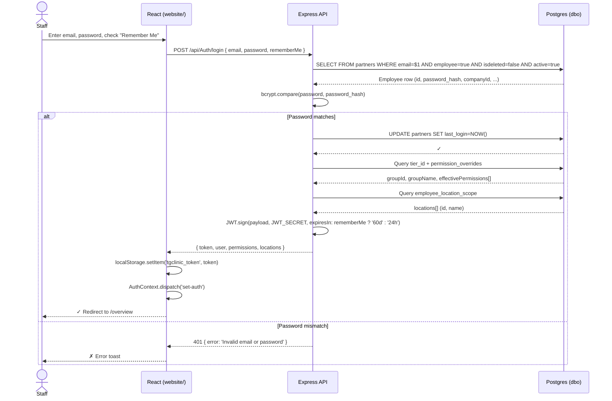
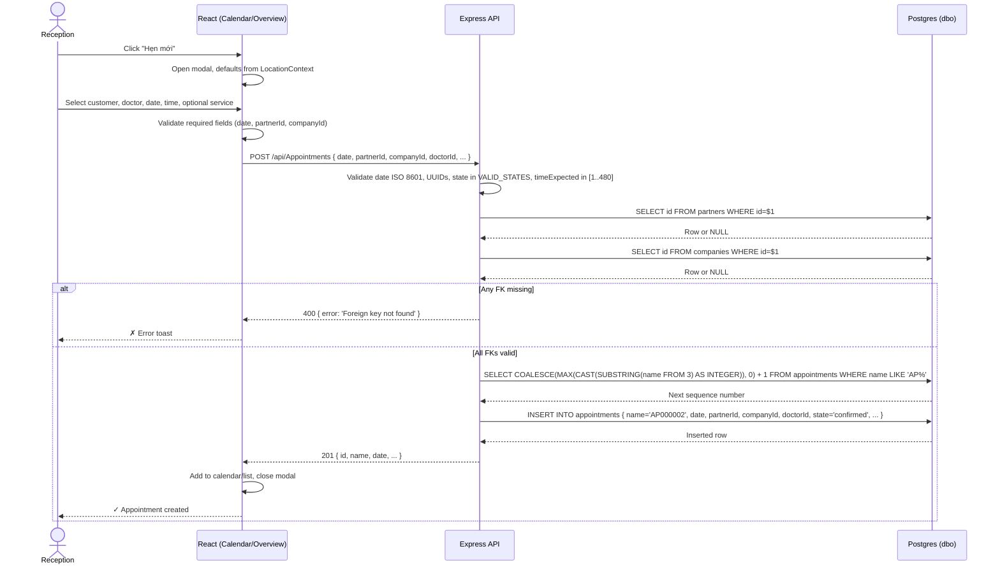
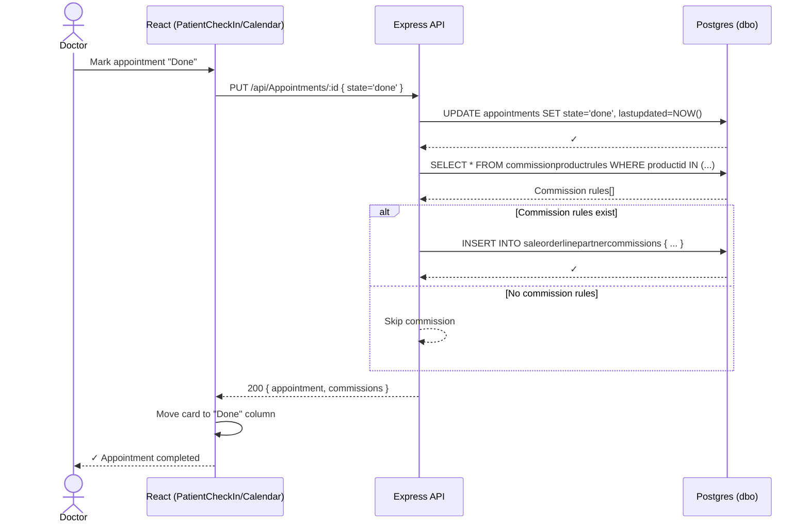
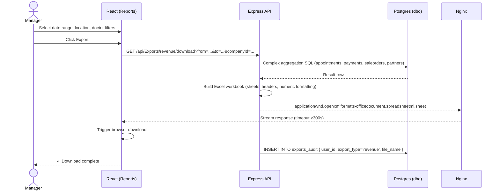
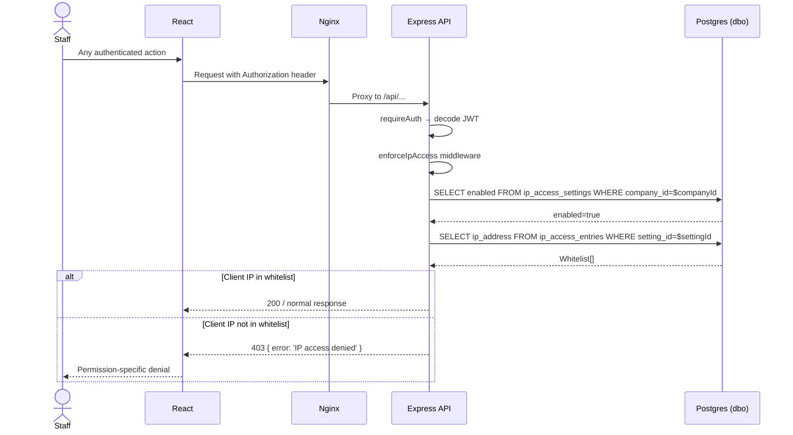
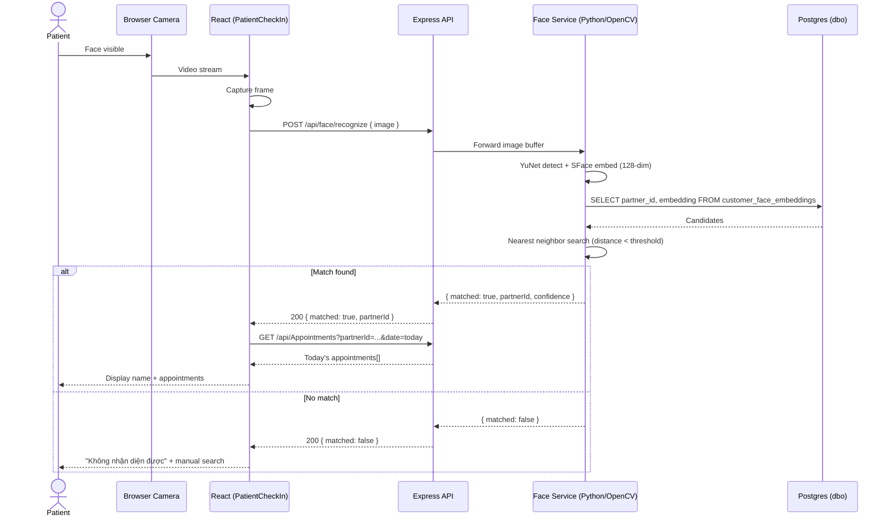
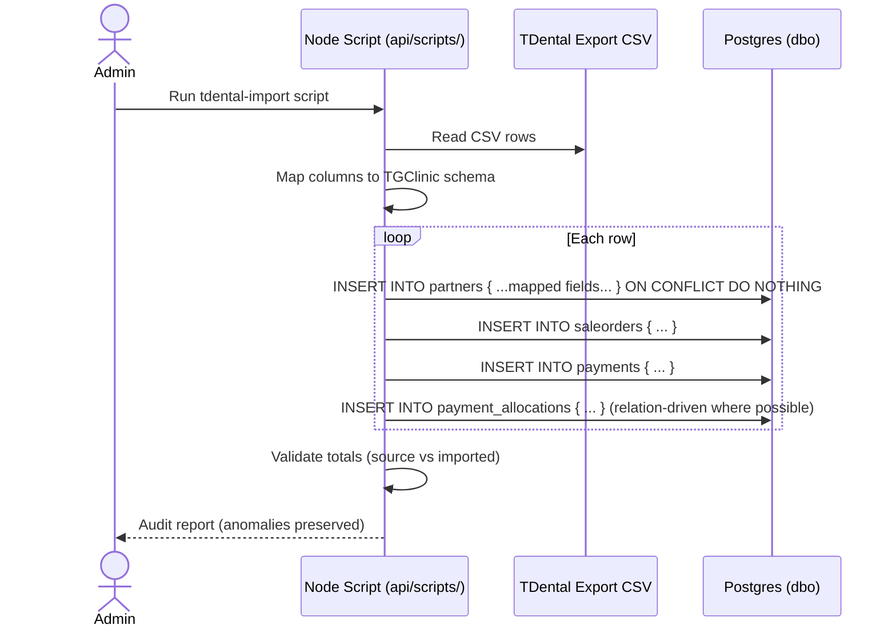
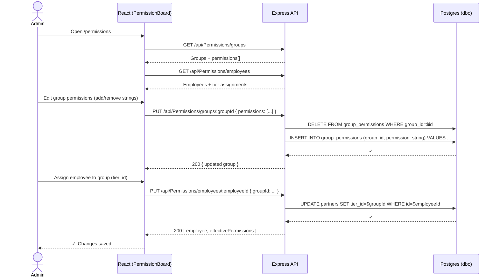
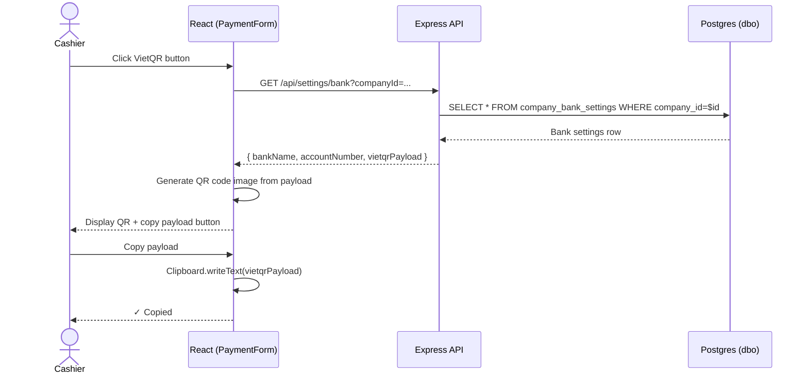

# TGroup Clinic — Workflows

> End-to-end business workflows as mermaid sequence diagrams. Actor, system, external services, and data state transitions shown.

---

## WF-001 — Login with Remember Me

**Trigger:** User submits `/login` form.
**Why it matters:** Authentication is the root of access control. Remember Me extends JWT lifetime from 24h to 60d.



**Data state transitions:**
- `partners.last_login` → current timestamp.
- `localStorage.tgclinic_token` → new JWT string.
- `AuthContext` → populated with user, permissions, locations.

**Invariants:** INV-007, INV-008.
**Failure modes:**
- `tier_id` NULL → empty permissions (INC-20260506-01).
- `JWT_SECRET` missing → API exits FATAL before listening.
- Token expiry after 60d → 401 on next request; user re-logins.

---

## WF-002 — Create Appointment

**Trigger:** Reception staff clicks "Hẹn mới" on Overview or Calendar.



**Data state transitions:**
- New row in `dbo.appointments` with `state='confirmed'`.
- Calendar cache invalidated; next poll fetches new row.

**Invariants:** INV-002, INV-006.
**Failure modes:**
- Doctor UUID stale → 400 "Foreign key not found".
- Location filter bypassed → backend accepts any `companyId` (INV-009).

---

## WF-003 — Take Deposit and Allocate

**Trigger:** Customer profile → "Đặt cọc" button.

```mermaid
sequenceDiagram
    actor S as Cashier
    participant FE as React (CustomerProfile)
    participant API as Express API
    participant DB as Postgres (dbo)
    
    S->>FE: Click "Đặt cọc"
    FE->>FE: Open modal, show open sale orders (residual > 0)
    S->>FE: Enter amount, select allocation method
    FE->>API: POST /api/Payments { amount, method, deposit_type='deposit', customerId, allocations: [...] }
    API->>API: Classify deposit; validate allocation residual
    API->>DB: SELECT residual FROM saleorders WHERE id=$1 AND isdeleted=false
    DB-->>API: residual per invoice
    alt Allocated amount > residual + 0.01
        API-->>FE: 400 { error: 'Over-allocation to invoice X' }
        FE-->>S: ✗ Show error
    else Allocation valid
        API->>DB: BEGIN
        API->>DB: INSERT INTO payments { ...deposit_type='deposit', status='posted' }
        DB-->>API: payment row
        API->>DB: INSERT INTO payment_allocations { payment_id, invoice_id, allocated_amount }
        DB-->>API: allocation row
        API->>DB: UPDATE saleorders SET residual = GREATEST(0, residual - $amount)
        DB-->>API: ✓
        API->>DB: COMMIT
        API-->>FE: 201 { id, amount, allocations }
        FE->>FE: Refresh profile, close modal
        FE-->>S: ✓ Deposit allocated
    end
```

**Data state transitions:**
- New `payments` row with `payment_category='deposit'`.
- New `payment_allocations` rows.
- `saleorders.residual` reduced (never below 0).

**Invariants:** INV-003, INV-004, INV-010, INV-011, INV-012.
**Failure modes:**
- Stale residual (paid via other channel) → over-charge risk.
- Concurrent deposits → race condition on residual (no row lock currently).

---

## WF-004 — Complete Appointment + Commission

**Trigger:** Doctor marks appointment as "Hoàn thành" (Done).



**Data state transitions:**
- `appointments.state` → `done`.
- `saleorderlinepartnercommissions` rows inserted (if rules match).

**Invariants:** None specific (commission auto-calculation trigger is unknown per `product-map/unknowns.md` #12).

---

## WF-005 — Generate Revenue Report Excel Export

**Trigger:** Reports page → Revenue → Export.



**Data state transitions:**
- New `exports_audit` row.

**Invariants:** INV-019 (nginx timeout), INV-020 (version bump).
**Failure modes:**
- Dataset too large → nginx 504 if timeout <300s.
- Memory exhaustion → API crash on extremely large date ranges.

---

## WF-006 — IP Access Gate

**Trigger:** Every non-public API request when IP access control is enabled for the company.



**Data state transitions:** None (read-only enforcement).
**Failure modes:**
- Admin locks themselves out → must connect from whitelisted IP or disable via DB directly.
- Proxy/load balancer changes client IP → whitelist mismatch.

---

## WF-007 — Face Recognition Check-In

**Trigger:** Patient stands in front of check-in camera.



**Data state transitions:** None (read-only recognition).
**Invariants:** INV-005 (128-dim embedding), INV-014 (Compreface optional).
**Failure modes:**
- Face service down → fallback to manual check-in (UC-008).
- Embedding dimension mismatch → recognition accuracy degrades or crashes.

---

## WF-008 — TDental CSV Import (One-Time / Sync)

**Trigger:** Admin runs import script for legacy TDental data.



**Data state transitions:**
- New rows in `partners`, `saleorders`, `saleorderlines`, `payments`, `payment_allocations`.
- Source anomalies preserved in audit output, not silently dropped.

**Invariants:** INV-003 (residual non-negative), INV-001 (UUID identity, not phone/ref).
**Failure modes:**
- Greedy remaining-balance allocation → incorrect residuals (must use relation-driven allocations).
- Duplicate refs/phones → UUID separates identities; do not merge blindly.

---

## WF-009 — Permission System Update (Admin)

**Trigger:** Admin edits permission group or employee assignment.



**Data state transitions:**
- `group_permissions` rows replaced for the group.
- `partners.tier_id` updated for the employee.

**Invariants:** INV-008 (shared resolution), INC-20260506-01 (tier_id NULL lock).
**Failure modes:**
- Typo in permission string → silent 403 for users in that group.
- `is_system=true` group deleted → seed data lost; admin UI should block this.

---

## WF-010 — VietQR Payment Generation

**Trigger:** Cashier clicks "Tạo VietQR" in payment flow.



**Data state transitions:** None (read-only settings consumption).
**Invariants:** None additional.
**Failure modes:**
- No bank settings for location → empty QR; cashier must configure in Settings first.
- Invalid VietQR payload format → bank app rejects scan.
