# TGroup Clinic — Workflows

> End-to-end business workflows as mermaid sequence diagrams. Actor, system, external services, and data state transitions shown.

## Traceability Convention

Every new or materially edited workflow should include one compact traceability line after the diagram or state-transition block: related UC IDs, current contracts/routes, data/tables, invariants, tests, and product-map domains. Prefer the current route method from `product-map/contracts/api-index.md`; use `unknown` instead of guessing.

---

## WF-001 — Login with Remember Me

**Trigger:** User submits `/login` form.
**Why it matters:** Authentication is the root of access control. Remember Me extends JWT lifetime from 24h to 60d.

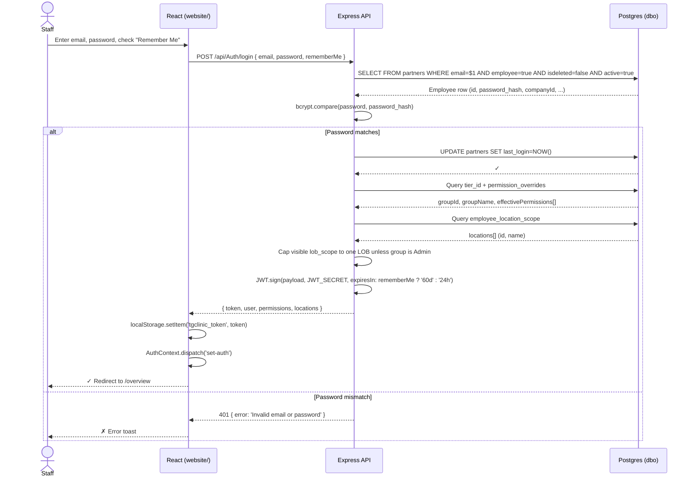

**Data state transitions:**
- `partners.last_login` → current timestamp.
- `user.lob_scope` / JWT `lob_scope` → multiple LOBs only for Admin; non-admin staff get one visible scoped LOB.
- `localStorage.tgclinic_token` → new JWT string.
- `AuthContext` → populated with user, permissions, locations.

**Invariants:** INV-007, INV-008, INV-008A.
**Failure modes:**
- `tier_id` NULL → empty permissions (INC-20260506-01).
- `JWT_SECRET` missing → API exits FATAL before listening.
- Token expiry after 60d → 401 on next request; user re-logins.

---

## WF-002 — Create Appointment

**Trigger:** Reception staff clicks "Hẹn mới" on Overview or Calendar.

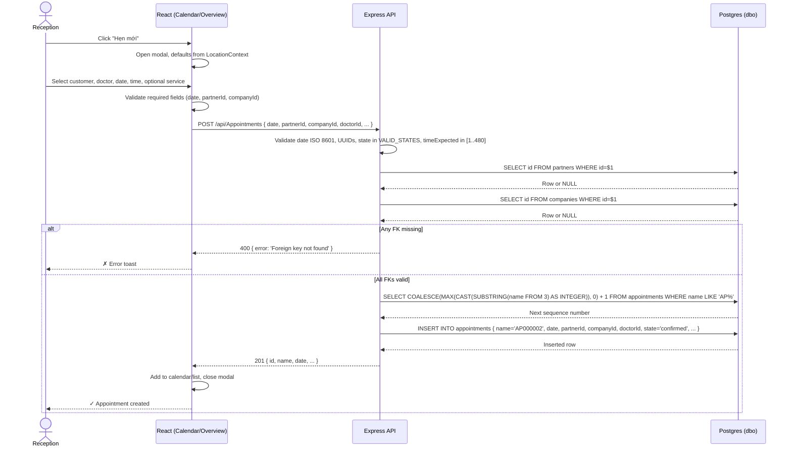

**Data state transitions:**
- New row in `dbo.appointments` with `state='confirmed'`.
- Calendar cache invalidated; next poll fetches new row.

**Invariants:** INV-002, INV-006.
**Failure modes:**
- Doctor UUID stale → 400 "Foreign key not found".
- Location filter bypassed → backend accepts any `companyId` (INV-009).

---

## WF-003 — Take Deposit and Allocate

**Trigger:** Customer profile → "Đặt cọc" button.

```mermaid
sequenceDiagram
    actor S as Cashier
    participant FE as React (CustomerProfile)
    participant API as Express API
    participant DB as Postgres (dbo)

    S->>FE: Click "Đặt cọc"
    FE->>FE: Open modal, show open sale orders (residual > 0)
    S->>FE: Enter amount, select allocation method
    FE->>API: POST /api/Payments { amount, method, deposit_type='deposit', customerId, allocations: [...] }
    API->>API: Classify deposit; validate allocation residual
    API->>DB: SELECT residual FROM saleorders WHERE id=$1 AND isdeleted=false
    DB-->>API: residual per invoice
    alt Allocated amount > residual + 0.01
        API-->>FE: 400 { error: 'Over-allocation to invoice X' }
        FE-->>S: ✗ Show error
    else Allocation valid
        API->>DB: BEGIN
        API->>DB: INSERT INTO payments { ...deposit_type='deposit', status='posted' }
        DB-->>API: payment row
        API->>DB: INSERT INTO payment_allocations { payment_id, invoice_id, allocated_amount }
        DB-->>API: allocation row
        API->>DB: UPDATE saleorders SET residual = GREATEST(0, residual - $amount)
        DB-->>API: ✓
        API->>DB: COMMIT
        API-->>FE: 201 { id, amount, allocations }
        FE->>FE: Refresh profile, close modal
        FE-->>S: ✓ Deposit allocated
    end
```

**Data state transitions:**
- New `payments` row with `payment_category='deposit'`.
- New `payment_allocations` rows.
- `saleorders.residual` reduced (never below 0).

**Invariants:** INV-003, INV-004, INV-010, INV-011, INV-012.
**Failure modes:**
- Stale residual (paid via other channel) → over-charge risk.
- Concurrent deposits → race condition on residual (no row lock currently).

---

## WF-004 — Complete Appointment + Commission

**Trigger:** Doctor marks appointment as "Hoàn thành" (Done).

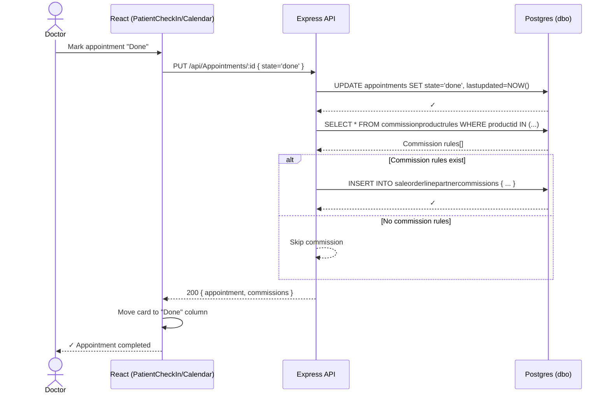

**Data state transitions:**
- `appointments.state` → `done`.
- `saleorderlinepartnercommissions` rows inserted (if rules match).

**Invariants:** None specific (commission auto-calculation trigger is unknown per `product-map/unknowns.md` #12).

---

## WF-005 — Generate Revenue Report Excel Export

**Trigger:** `/reports/revenue` → operational export menu.

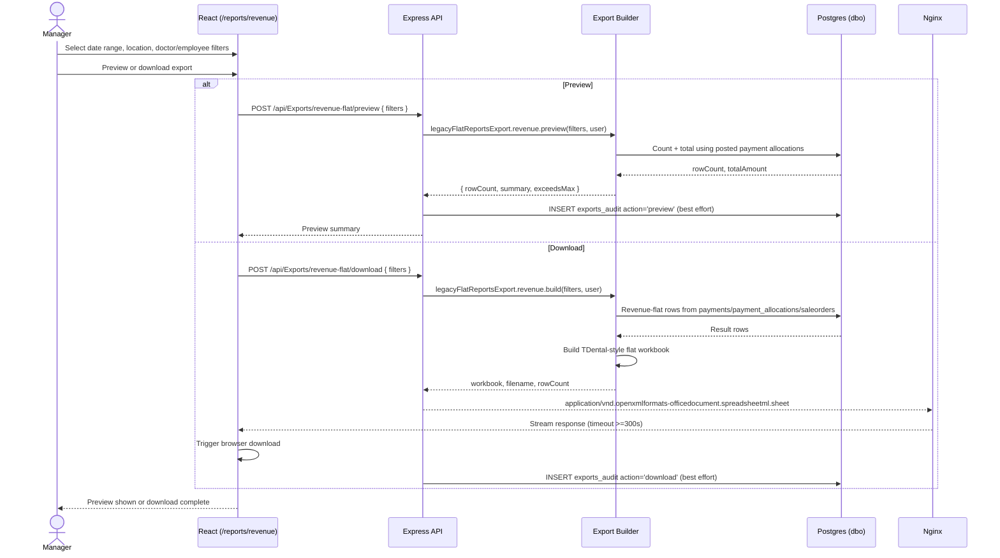

**Data state transitions:**
- Optional `exports_audit` row with `export_type='revenue-flat'` and `action='preview'` or `action='download'`.
- Report data is read-only; revenue is recognized from posted payment allocations, not raw order totals.

**Traceability:** Related UCs: UC-013, UC-019. Contracts/routes: `POST /api/Reports/revenue/*`, `POST /api/Reports/cash-flow/summary`, `POST /api/Exports/:type/preview`, `POST /api/Exports/:type/download` with `revenue-flat` or `report-sales-employees`. Data/tables: `dbo.payment_allocations`, `dbo.payments`, `dbo.saleorders`, `dbo.saleorderlines`, `dbo.partners`, `dbo.companies`, `dbo.exports_audit`. Invariants: INV-019, INV-020. Tests: `api/src/routes/reports/__tests__/revenueRecognition.test.js`, `api/src/routes/reports/__tests__/cashFlow.test.js`, `api/src/routes/reports/__tests__/servicesBreakdown.test.js`, `api/src/services/reports/__tests__/canonicalRevenue.test.js`, `api/src/services/exports/__tests__/legacyFlatReportsExport.test.js`, `api/src/services/exports/__tests__/reportSalesEmployeesExport.test.js`, `website/src/hooks/__tests__/useReportData.test.ts`, `website/src/pages/reports/__tests__/ReportsSubpages.test.tsx`. Product-map domains: `reports-analytics`, `payments-deposits`, `employees-hr`.

**Failure modes:**
- Dataset too large → nginx 504 if timeout <300s.
- `EXPORT_ROW_LIMIT_EXCEEDED` → preview/download must surface row-limit guidance.
- Export audit insert failure is best effort and must not corrupt the workbook response.

---

## WF-006 — IP Access Gate

**Trigger:** Every non-`/api/IpAccess/*` API request after IP access middleware is mounted.

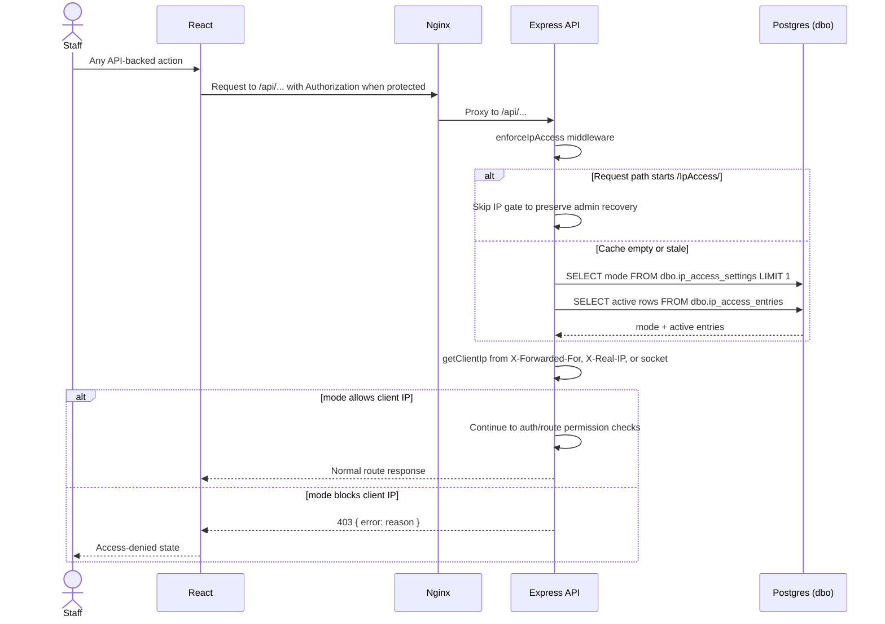

**Data state transitions:** None during enforcement; settings changes through `/api/IpAccess/settings` and `/api/IpAccess/entries` invalidate the in-memory IP access cache.

**Traceability:** Related UC: UC-017. Contracts/routes: `GET /api/IpAccess/settings`, `PUT /api/IpAccess/settings`, `GET /api/IpAccess/entries`, `POST /api/IpAccess/entries`, `PUT /api/IpAccess/entries/:id`, `DELETE /api/IpAccess/entries/:id`, `GET /api/IpAccess/check`. Data/tables: `dbo.ip_access_settings`, `dbo.ip_access_entries`. Invariants: INV-008, INV-018. Tests: `website/src/__tests__/IpAccessControl.component.test.tsx`, `website/src/__tests__/ipAccessControl.types.test.ts`, `website/src/__tests__/ipValidation.edgecases.test.ts`, `website/e2e/login-and-settings.spec.ts`; backend middleware/route coverage is still a gap. Product-map domains: `settings-system`, `auth`.

**Failure modes:**
- DB read failure in the middleware fails open and logs the problem.
- Proxy/load balancer changes client IP → whitelist/blacklist may not match the intended address.
- `block_all` can lock staff out of non-management API routes; `/api/IpAccess/*` is intentionally skipped by the IP gate but still requires normal settings permissions.

## WF-007 — Face Recognition Check-In

**Trigger:** Patient stands in front of check-in camera.

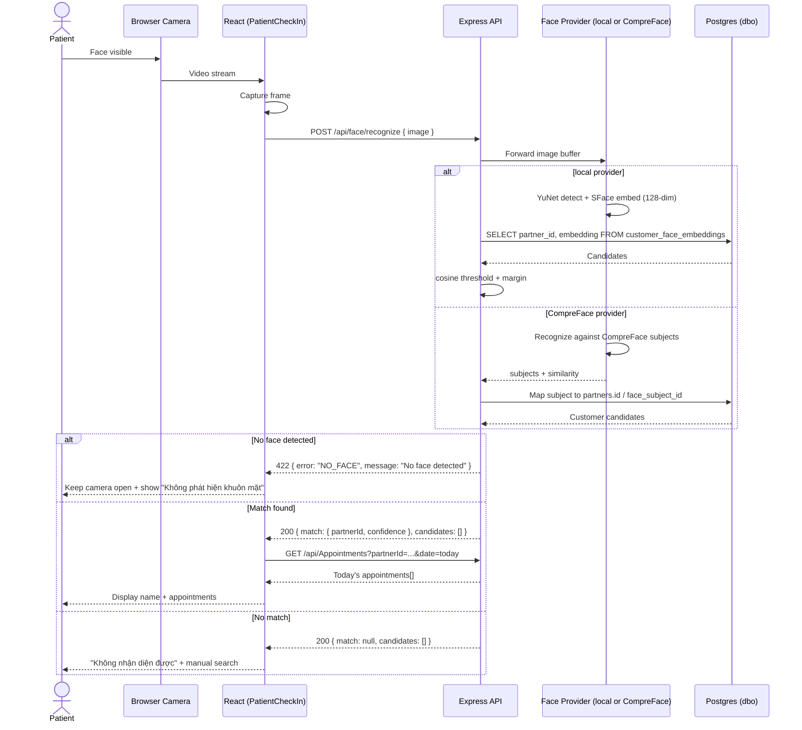

**Data state transitions:** None (read-only recognition).
**Invariants:** INV-005 (local 128-dim embedding), INV-014 (optional Face ID provider).
**Failure modes:**
- Provider cannot detect a face → API returns `NO_FACE`; frontend keeps camera open until manual close.
- Configured Face ID provider down → fallback to manual check-in (UC-008).
- Embedding dimension mismatch → recognition accuracy degrades or crashes.

---

## WF-008 — TDental CSV Import (One-Time / Sync)

**Trigger:** Admin runs import script for legacy TDental data.

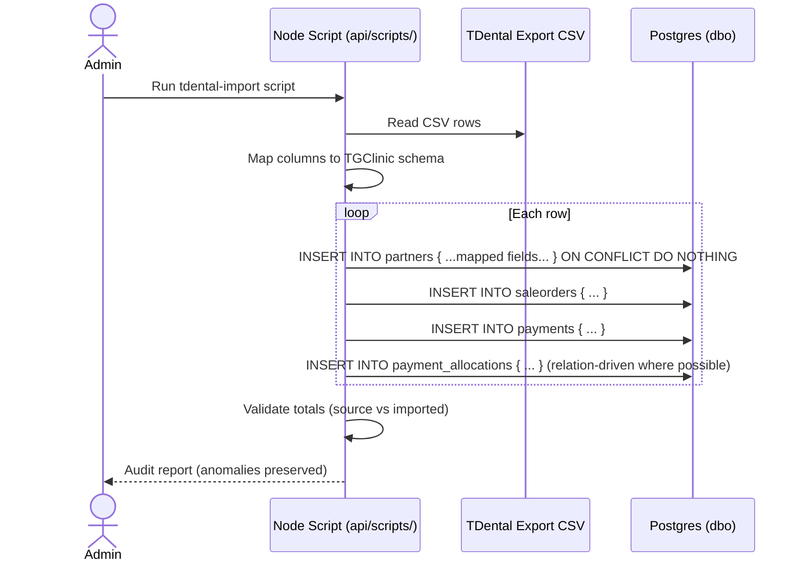

**Data state transitions:**
- New rows in `partners`, `saleorders`, `saleorderlines`, `payments`, `payment_allocations`.
- Source anomalies preserved in audit output, not silently dropped.

**Invariants:** INV-003 (residual non-negative), INV-001 (UUID identity, not phone/ref).
**Failure modes:**
- Greedy remaining-balance allocation → incorrect residuals (must use relation-driven allocations).
- Duplicate refs/phones → UUID separates identities; do not merge blindly.

---

## WF-009 — Permission System Update (Admin)

**Trigger:** Admin edits permission group or employee assignment.

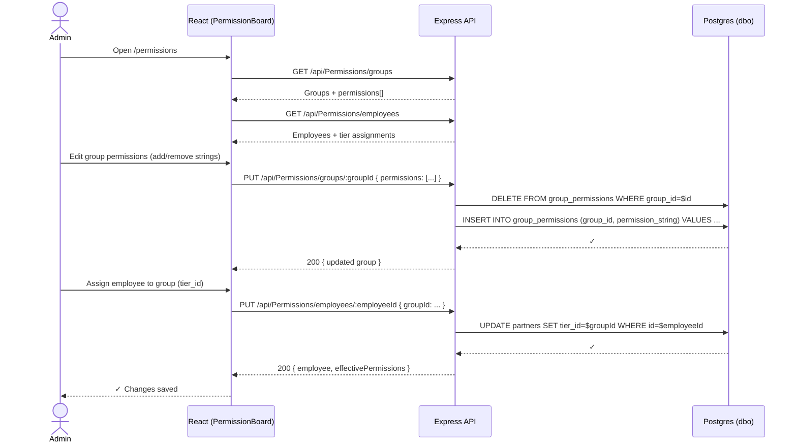

**Data state transitions:**
- `group_permissions` rows replaced for the group.
- `partners.tier_id` updated for the employee.

**Invariants:** INV-008 (shared resolution), INC-20260506-01 (tier_id NULL lock).
**Failure modes:**
- Typo in permission string → silent 403 for users in that group.
- `is_system=true` group deleted → seed data lost; admin UI should block this.

---

## WF-010 — VietQR Payment Generation

**Trigger:** Cashier clicks "Tạo VietQR" in payment flow.

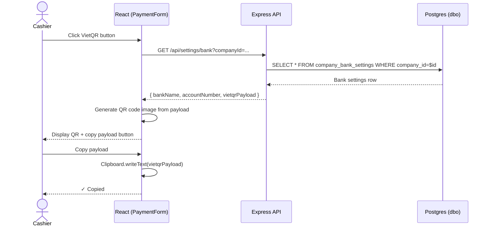

**Data state transitions:** None (read-only settings consumption).
**Invariants:** None additional.
**Failure modes:**
- No bank settings for location → empty QR; cashier must configure in Settings first.
- Invalid VietQR payload format → bank app rejects scan.

---

## WF-011 — Feedback Thread Moderation

**Trigger:** Admin opens `/feedback` to triage staff/user feedback.

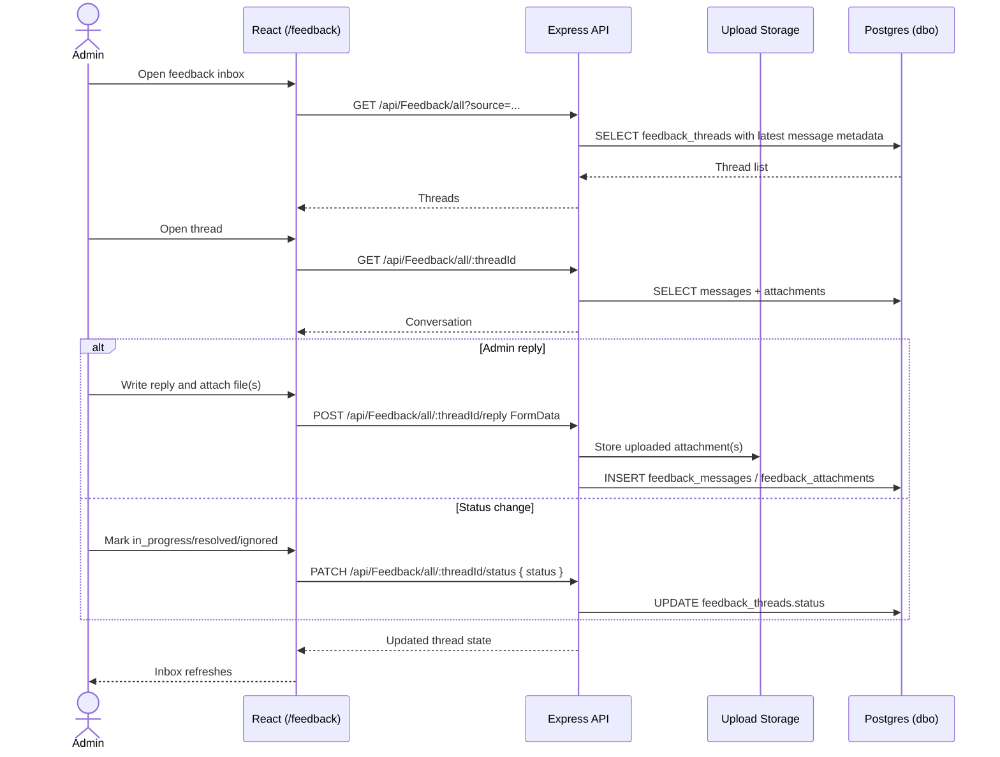

**Data state transitions:**
- `feedback_threads.status` changes for moderation.
- `feedback_messages` and `feedback_attachments` rows are inserted for admin replies; files are stored under `api/uploads/feedback/`.

**Traceability:** Related UC: UC-020. Contracts/routes: `GET /api/Feedback/all`, `GET /api/Feedback/all/:threadId`, `POST /api/Feedback/all/:threadId/reply`, `PATCH /api/Feedback/all/:threadId/status`, `DELETE /api/Feedback/all/:threadId`. Data/tables: `dbo.feedback_threads`, `dbo.feedback_messages`, `dbo.feedback_attachments`, `api/uploads/feedback/`. Invariants: INV-015, INV-016, INV-017. Tests: `api/tests/readRoutePermissions.test.js`, `website/e2e/phase2-quick-features.spec.ts` indirect; file storage/deletion E2E remains a gap. Product-map domains: `feedback-cms`, `auth`.

**Failure modes:**
- Missing scoped feedback permission causes 403 on the specific action.
- Attachment upload succeeds but DB insert fails → orphan-file cleanup must be checked when changing upload handling.

---

## WF-012 — Monthly Plan Installment Payment

**Trigger:** Cashier pays an installment from a monthly plan.

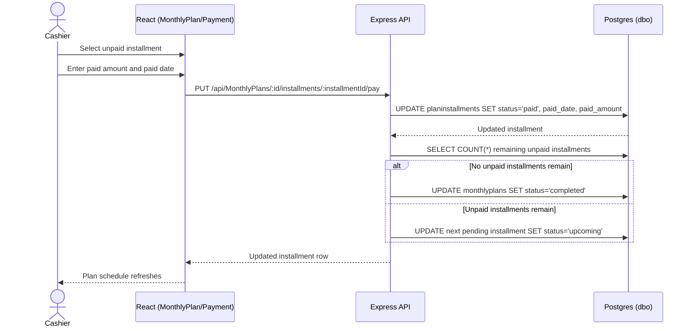

**Data state transitions:**
- `planinstallments.status` becomes `paid`.
- `monthlyplans.status` becomes `completed` only when all installments are paid.
- Current route does not create a `payments` ledger row.

**Traceability:** Related UC: UC-018. Contracts/routes: `GET /api/MonthlyPlans`, `GET /api/MonthlyPlans/:id`, `PUT /api/MonthlyPlans/:id/installments/:installmentId/pay`. Data/tables: `dbo.monthlyplans`, `dbo.monthlyplan_items`, `dbo.planinstallments`. Invariants: INV-020 for runtime changes; payment invariants apply if ledger creation is later added. Tests: no dedicated monthly-plan installment tests yet. Product-map domains: `payments-deposits`, `customers-partners`.

**Failure modes:**
- Route currently requires `payment.edit`, not `payment.add`; permission wording must stay explicit until product decides otherwise.
- Plan can show paid without a matching `dbo.payments` row, so finance reconciliation must not assume installment-pay equals cash receipt.

---

## WF-013 — Reports Revenue Screen Uses Canonical Revenue and Operational Exports

**Trigger:** Manager opens `/reports/revenue`.

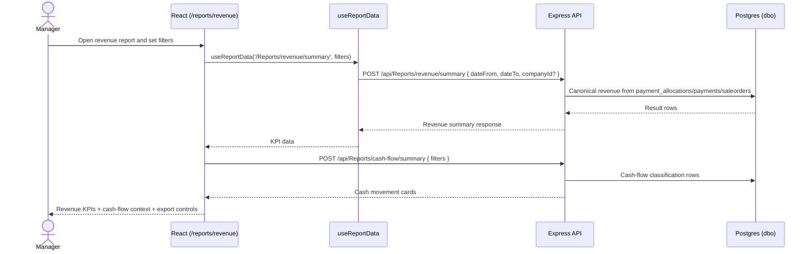

**Data state transitions:**
- None. This screen reads canonical paid revenue and cash-flow context.

**Traceability:** Related UCs: UC-013, UC-019. Contracts/routes: `POST /api/Reports/revenue/summary`, `POST /api/Reports/revenue/trend`, `POST /api/Reports/revenue/by-location`, `POST /api/Reports/revenue/by-doctor`, `POST /api/Reports/revenue/by-category`, `POST /api/Reports/revenue/rules`, `POST /api/Reports/cash-flow/summary`, `POST /api/Exports/report-sales-employees/preview`. Data/tables: `dbo.payment_allocations`, `dbo.payments`, `dbo.saleorders`, `dbo.saleorderlines`, `dbo.partners`, `dbo.companies`. Invariants: INV-003, INV-012, INV-019. Tests: `api/src/routes/reports/__tests__/revenueRecognition.test.js`, `api/src/routes/reports/__tests__/cashFlow.test.js`, `api/src/services/reports/__tests__/canonicalRevenue.test.js`, `website/src/hooks/__tests__/useReportData.test.ts`, `website/src/pages/reports/__tests__/ReportsSubpages.test.tsx`. Product-map domains: `reports-analytics`, `payments-deposits`.

**Failure modes:**
- Cash-flow cards are cash movement context and must not be treated as the paid-revenue source of truth.
- Location scope mismatches can make report totals differ by user role.

---

## WF-014 — DotKham / Medical-History Long-Text Inspection

**Trigger:** Staff opens a customer profile containing long migrated medical-history or DotKham-related text.

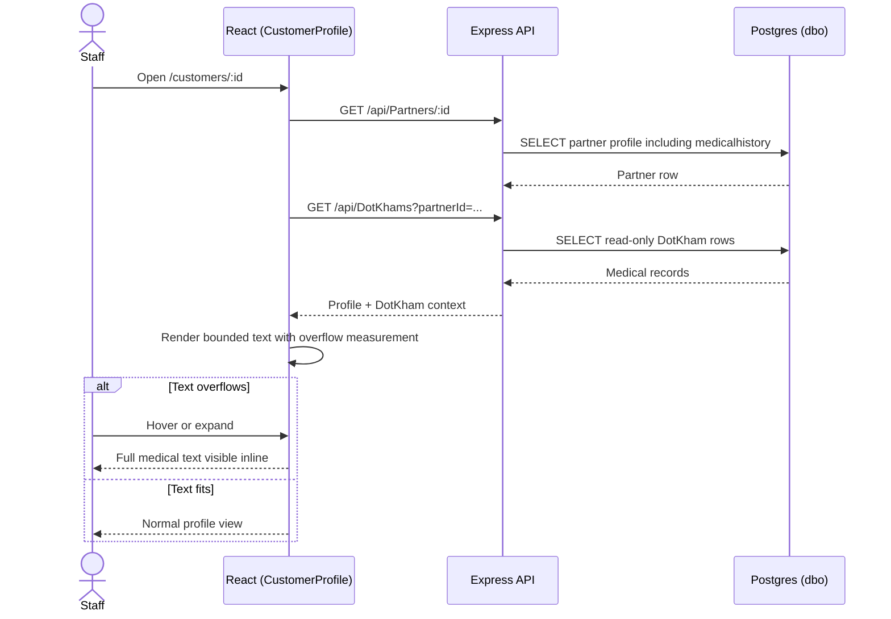

**Data state transitions:** None; DotKham records are read-only in the current UI.

**Traceability:** Related UC: UC-021. Contracts/routes: `GET /api/Partners/:id`, `GET /api/DotKhams`. Data/tables: `dbo.partners.medicalhistory`, `dbo.dotkhams`, `dbo.dotkhamsteps`. Invariants: INV-015, INV-016, INV-017. Tests: `website/src/components/customer/CustomerProfile.test.tsx`, `website/src/hooks/__tests__/useCustomerProfile.date-normalization.test.tsx`; no dedicated DotKham tooltip regression yet. Product-map domains: `customers-partners`, `services-catalog`, `payments-deposits` when payment allocation context is shown.

**Failure modes:**
- Long Vietnamese text clips or overlaps if `ExpandableText`/runtime overflow detection is bypassed.
- DotKham rows may be read-only or sync-owned; avoid implying unsupported edits.

---

## WF-015 — CTV Referral Booking Makes Client Searchable

**Trigger:** A CTV submits the `/ctv` refer-client booking sheet for a Dental or Cosmetic client.

```mermaid
sequenceDiagram
    actor C as CTV
    participant FE as CTV Portal
    participant API as Express API
    participant DB as Selected LOB DB
    participant Admin as Admin Customers

    C->>FE: Enter phone, LOB, optional service/note; date defaults to today's Vietnam date
    FE->>API: GET /api/ctv/client-lookup?phone=&lob=
    API->>DB: SELECT partner by phone
    API-->>FE: exists / claim status
    opt exists and not claimed
        FE->>FE: Prefill name from lookup result
    end
    C->>FE: Submit booking
    FE->>API: POST /api/ctv/bookings
    API->>DB: Resolve existing partner by clientId or phone
    alt active claim owned by another CTV
        API-->>FE: 400 B_CLIENT_CLAIMED
    else new client
        API->>DB: INSERT partners { customer=true, referred_by_ctv_id=CTV }
    else existing accepted partner
        API->>DB: UPDATE partners SET customer=true, referred_by_ctv_id=CTV
    end
    API->>DB: Create appointment only
    API-->>FE: 201 { clientId, appointmentId }
    Admin->>API: GET /api/cosmetic/Partners?search=<name or phone>
    API-->>Admin: Client row appears because customer=true
```

**Data state transitions:**
- Existing accepted partner row keeps the same UUID and gets `customer=true`.
- `partners.referred_by_ctv_id` points to the submitting CTV.
- New appointment row is created in the selected LOB database.
- No `saleorders` or `saleorderlines` service card is created by this booking flow.
- The CTV sheet initializes `date` to `Asia/Ho_Chi_Minh` today so mobile users do not submit an empty required appointment date.

**Invariants:** INV-001, INV-002, INV-006, INV-021.
**Traceability:** Related UC: UC-022. Contracts/routes: `GET /api/ctv/client-lookup`, `POST /api/ctv/bookings`, `GET /api/Partners`, `GET /api/cosmetic/Partners`. Data/tables: `dbo.partners`, `dbo.appointments`. Tests: `api/src/routes/__tests__/ctvBookings.test.js`, `website/src/components/ctv/CtvReferModal.test.tsx`. Product-map domains: `ctv`, `cosmetic`, `cosmetic-clients`, `customers-partners`, `appointments-calendar`.
