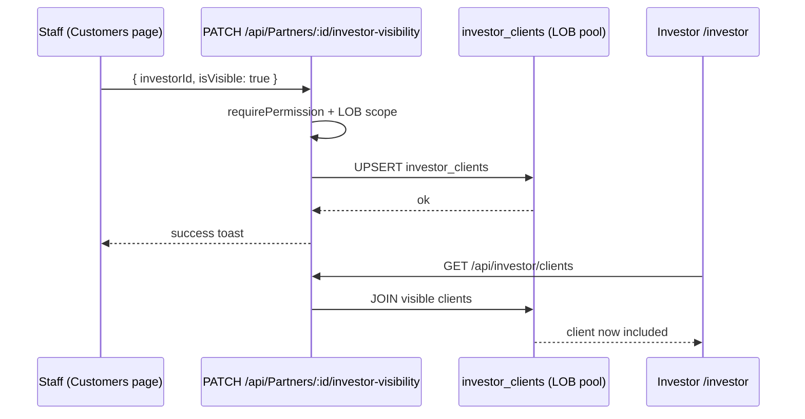
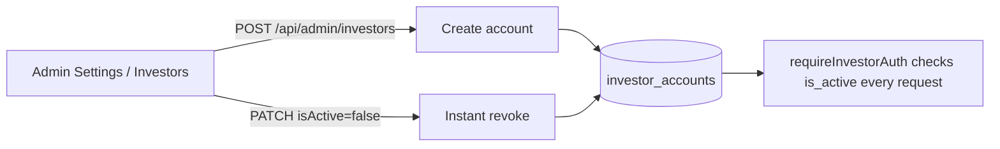
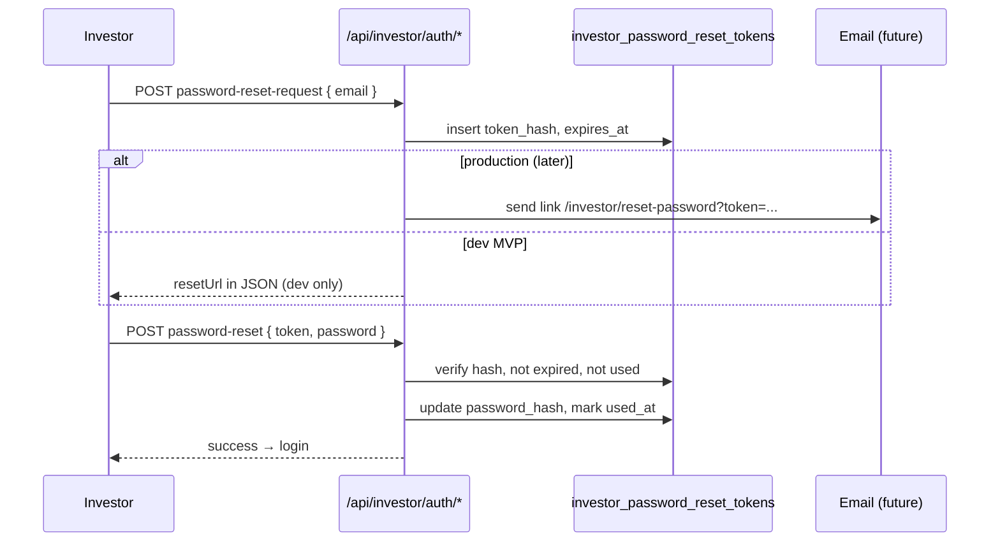

# PRD — Investor Portal Phase 2 (Staff Curation + Admin Provisioning + Password Reset)

> **Status:** Ready for build · **Owner:** TBD · **Target version:** `website` **0.39.0** (minor bump)
> **Builds on:** v0.38.0 MVP (`docs/specs/INVESTOR_PORTAL_PRD.md`, `DEC-20260625-IP-01`)
> **In scope:** Staff checkbox on Customers, Admin create/deactivate investors, Investor password reset
> **Out of scope (V2):** invite email delivery, bulk multi-select, Manager-tier toggle delegation, cross-LOB investors, CSV export

---

## 1. Summary

Phase 1 shipped investor **login** and a **read-only client roster** (`/investor`, `/api/investor/*`). Phase 2 closes the operational loop: staff can **curate** which clients each investor sees, admins can **provision and deactivate** investor accounts, and investors can **reset forgotten passwords** without staff intervention.

Without Phase 2, curation requires `seed-investor-demo.js` or raw SQL — not production-ready.

### Problem
- Staff have no UI to share/unshare a client with an investor.
- Admins have no UI to create investors or deactivate access instantly.
- Investors have no self-service password recovery.

### Goals
- Staff toggles visibility per client × per investor (current LOB only).
- Admin provisions investor (email, name, LOB, initial password shown once) and can deactivate/reactivate.
- Investor resets password via email token flow (request → link/token → new password).
- All flows governed: permissions, contracts, docs, tests, E2E proof.

### Non-goals
- Sending actual email (v2.1): MVP returns reset token in API response **dev-only**; production uses manual admin copy or future email integration.
- Investor self-signup.
- Cross-LOB investors.

---

## 2. What's Already Shipped (Phase 1 — do not rebuild)

| Asset | Location |
|---|---|
| Tables | `investor_accounts`, `investor_clients`, `investor_view_audit` (migration 068) |
| Auth | `INVESTOR_JWT_SECRET`, `requireInvestorAuth`, login/me |
| Read API | `GET /api/investor/clients`, `GET /api/investor/clients/:partnerId` |
| Portal UI | `/investor/login`, `/investor` dashboard |
| Contracts | `contracts/investor.ts` (login, client response schemas) |
| Demo seed | `api/scripts/seed-investor-demo.js` |

---

## 3. Actors & Permissions

| Actor | Permission | Capability |
|---|---|---|
| **Staff (curator)** | `customers.set_investor_visibility` | Toggle client visibility for investors in **current LOB** |
| **Admin** | `investors.manage` | CRUD investor accounts, view audit summary, copy initial/reset tokens in dev |
| **Investor** | — (public reset routes) | Request password reset, set new password |
| **System** | — | Audit `investor_clients` writes + `investor_view_audit` |

**Register both permissions** in `product-map/contracts/permission-registry.yaml` and grant to Admin tier in migration `069_investor_permissions.sql` (both DBs).

---

## 4. Feature A — Staff Checkbox on Customers

### 4.1 User story
As clinic staff with curation permission, I select an investor for the current LOB and toggle whether this customer is visible to them, so the investor portal reflects my curated book of business.

### 4.2 Expected behavior

| Visit / action | Expected result |
|---|---|
| Open `/customers` with permission + ≥1 investor in LOB | New column or row action: investor visibility control |
| Toggle **on** for client C + investor I | Confirm dialog (F1): *"This client will be visible to investor &lt;name&gt;."* → `investor_clients` upsert `is_visible=true` |
| Toggle **off** | No confirm required → `is_visible=false` (row kept for audit) |
| Investor refreshes `/investor` | Client appears/disappears accordingly |
| No permission | Control disabled + tooltip (F2) |
| Client soft-deleted | Control disabled + tooltip |
| No investors in LOB | Control disabled + tooltip *"Create an investor first"* |
| API error on save | Optimistic rollback + typed error toast |

### 4.3 UI design

**Placement:** `CustomerColumns.tsx` — new column **"Investor"** (or icon column) after Status, ~12% width.

**Control pattern:**
- If **1 investor** in current LOB → single checkbox bound to that investor.
- If **>1 investors** → compact dropdown (investor name) + checkbox for selected investor.
- Load initial state: `GET /api/investor-visibility?partnerId=&investorId=` or batch on list load.

**i18n:** `website/src/i18n/locales/{en,vi}/customers.json` keys under `investorVisibility.*`.

### 4.4 API

#### `GET /api/investor-visibility`
Staff + `customers.set_investor_visibility` (or `customers.view` for read-only column state).

| Query | Response |
|---|---|
| `partnerId` (uuid), optional `investorId` | `{ success, items: [{ investorId, investorName, isVisible }] }` |
| `partnerIds` (comma-separated, max 50) | Batch for list column — avoids N+1 |

Uses `getQuery(req)` for **current LOB** from `BusinessUnitContext` / cosmetic mirror prefix.

#### `PATCH /api/Partners/:id/investor-visibility`
Staff + `customers.set_investor_visibility`.

```json
{ "investorId": "uuid", "isVisible": true }
```

**Server rules:**
- Body **only** `{ investorId, isVisible }` — no mass-assignment (SEC-03).
- Validate partner exists, `customer=true`, `isdeleted=false`.
- Validate investor exists in **same LOB** pool, `is_active=true` (cannot share to deactivated investor).
- Upsert `investor_clients` with `marked_by_partner_id = req.user.partnerId`.
- LOB on row = investor's lob = current request LOB.
- Returns `{ success, investorId, partnerId, isVisible }`.

**Mount:** add to `api/src/routes/partners.js` or `api/src/routes/investor/admin.js` under staff auth (NOT under `/api/investor` investor JWT).

### 4.5 Flow diagram



---

## 5. Feature B — Admin Create / Deactivate Investors

### 5.1 User story
As admin, I create investor accounts (email, display name, LOB, initial password), deactivate compromised accounts, and see who has access — without touching SQL or seed scripts.

### 5.2 Expected behavior

| Visit / action | Expected result |
|---|---|
| Settings → **Investors** tab (admin only) | List investors for current LOB + create form |
| Create investor | Email unique, LOB select, random initial password (12 chars) shown **once** in modal |
| Deactivate | Confirm → `is_active=false` → investor blocked on next API call (instant) |
| Reactivate | `is_active=true` |
| Edit name only | `PATCH` updates `investor_name` |
| Cannot delete | Soft lifecycle via `is_active` only (preserve audit trail) |

### 5.3 UI design

**Surface:** New Settings tab `investors` in `website/src/pages/Settings/index.tsx`, visible when `hasPermission('investors.manage')`.

**Component:** `website/src/components/settings/InvestorManagement.tsx`
- DataTable: email, name, lob, is_active, last_login, client_count (aggregate)
- Actions: Deactivate / Reactivate / Reset password (triggers admin-initiated reset — optional shortcut)
- Create modal: email, investor_name, lob (default current LOB)

**i18n:** `website/src/i18n/locales/{en,vi}/investorAdmin.json`

### 5.4 API (staff-authenticated, under `/api/admin/investors` or `/api/investors`)

| Method | Route | Permission | Body | Response |
|---|---|---|---|---|
| GET | `/api/admin/investors` | `investors.manage` | `lob?` | Paginated list (safe fields — no password_hash) |
| POST | `/api/admin/investors` | `investors.manage` | `{ email, investorName, lob, password? }` | `{ success, investor, initialPassword? }` — if password omitted, server generates |
| PATCH | `/api/admin/investors/:id` | `investors.manage` | `{ investorName?, isActive? }` | Updated investor |
| GET | `/api/admin/investors/:id/clients` | `investors.manage` | — | Count + optional list of visible partner ids (admin audit) |
| GET | `/api/admin/investors/:id/audit` | `investors.manage` | `limit, offset` | Recent `investor_view_audit` rows |

**Rules:**
- `POST` email unique per DB (LOB pool); bcrypt hash password.
- `created_by_partner_id` = admin's partner id.
- Never return `password_hash`.
- Deactivate does **not** delete `investor_clients` rows (visibility preserved if reactivated).

### 5.5 Flow diagram



---

## 6. Feature C — Investor Password Reset

### 6.1 User story
As an investor who forgot my password, I request a reset from `/investor/login`, receive a token (email in production; dev shows link), and set a new password.

### 6.2 Expected behavior

| Visit / action | Expected result |
|---|---|
| `/investor/login` → "Forgot password?" | Navigate to `/investor/reset-password` |
| Submit email | Always `200` with generic message (no email enumeration) |
| Valid email + active account | Single-use token created (1h TTL), hashed at rest |
| Submit token + new password | Password updated, token consumed, redirect to login |
| Expired/used token | `400` with typed code `U_RESET_TOKEN_INVALID` |
| Weak password (<6 chars) | `400` `U_WEAK_PASSWORD` |
| Rate limit | 5 requests / 15 min per email + IP (same as staff login) |

### 6.3 Schema addition (migration 069)

```sql
CREATE TABLE dbo.investor_password_reset_tokens (
  id UUID PRIMARY KEY DEFAULT gen_random_uuid(),
  investor_id UUID NOT NULL REFERENCES dbo.investor_accounts(id) ON DELETE CASCADE,
  token_hash TEXT NOT NULL,
  expires_at TIMESTAMPTZ NOT NULL,
  used_at TIMESTAMPTZ,
  created_at TIMESTAMPTZ NOT NULL DEFAULT now()
);
CREATE INDEX idx_investor_reset_investor ON dbo.investor_password_reset_tokens(investor_id);
```

Apply to **both** `tdental_demo` and `tcosmetic_demo`.

### 6.4 API (public — add to `publicApiPaths.js`)

| Method | Route | Body | Response |
|---|---|---|---|
| POST | `/api/investor/auth/password-reset-request` | `{ email }` | `{ success, message }` — dev: `{ resetUrl?, token? }` when `NODE_ENV=development` |
| POST | `/api/investor/auth/password-reset` | `{ token, password, confirmPassword }` | `{ success }` |

**Security (SEC-06):**
- Token: `crypto.randomBytes(32)` → base64url; store `sha256(token)` only.
- Invalidate prior unused tokens for same investor on new request.
- Single-use: set `used_at` on success.
- Login rate limiters reused on both routes.

### 6.5 UI

- `website/src/pages/Investor/InvestorResetPassword.tsx` — two steps: request email → enter token + new password (token from URL query `?token=` when email link exists).
- Link from `InvestorLogin.tsx`: "Forgot password?" → `/investor/reset-password`.
- i18n: `investor.json` keys under `reset.*`.

### 6.6 Flow diagram



---

## 7. Contracts (extend `contracts/investor.ts` FIRST)

| Schema | Purpose |
|---|---|
| `InvestorVisibilityPatchSchema` | `{ investorId, isVisible }` |
| `InvestorVisibilityStateSchema` | `{ investorId, investorName, isVisible }` |
| `InvestorAdminCreateSchema` | `{ email, investorName, lob, password? }` |
| `InvestorAdminUpdateSchema` | `{ investorName?, isActive? }` |
| `InvestorPasswordResetRequestSchema` | `{ email }` |
| `InvestorPasswordResetConfirmSchema` | `{ token, password, confirmPassword }` |

Bump `docs/CONTRACTS.md` → **v1.0.38**.

---

## 8. Build order (contracts-first)

1. Migration `069_investor_phase2.sql` — reset tokens table + permission grants
2. Extend `contracts/investor.ts` + build `@tgroup/contracts`
3. Register permissions in `permission-registry.yaml`
4. Backend routes:
   - `api/src/routes/investor/admin.js` (staff CRUD)
   - `api/src/routes/partners/investorVisibility.js` or patch on `partners.js`
   - Extend `api/src/routes/investor/auth.js` (reset routes)
   - `publicApiPaths.js` + rate limits on reset routes
5. Frontend API clients: `website/src/lib/api/investorAdmin.ts`, extend `partners.ts`
6. UI: `CustomerColumns` toggle, `InvestorManagement` settings tab, reset password pages
7. Tests + E2E + docs + **0.39.0**

---

## 9. Testing & Definition of Done

### Integration tests
- PATCH visibility: upsert, wrong LOB investor → 400, soft-deleted client → 404
- Admin create: duplicate email → 409, deactivate → investor `/me` → 403
- Reset: happy path, expired token, reuse token, enumeration-safe request

### E2E (Playwright — mandatory)
1. Admin creates investor → copy password
2. Staff toggles client ON for that investor (confirm dialog)
3. Investor logs in → sees exactly that client
4. Staff toggles OFF → client gone on refresh
5. Investor requests reset → sets new password → logs in
6. Screenshots: Customers toggle, Settings investors tab, reset flow (375 + 1440)

### Governance checklist
- [ ] `contracts/investor.ts` extended
- [ ] `docs/CONTRACTS.md` v1.0.38
- [ ] `docs/MIGRATIONS.md` §069
- [ ] `product-map/domains/investor-portal.yaml` updated
- [ ] `product-map/schema-map.md` reset tokens table
- [ ] `docs/USE-CASES.md`, `docs/WORKFLOWS.md` Phase 2 flows
- [ ] `docs/TEST-MATRIX.md` Phase 2 rows
- [ ] `docs/CHANGELOG.md` + `website/public/CHANGELOG.json` **0.39.0**
- [ ] `testbright.md` Phase 2 checklist
- [ ] `@crossref` on all new files

---

## 10. Phasing within Phase 2

| Wave | Deliverable | Depends on |
|---|---|---|
| **2a** | Permissions migration + Admin API + Settings UI | — |
| **2b** | Staff visibility PATCH + Customers column | 2a (need investors to exist) |
| **2c** | Password reset API + UI | — (can parallel with 2b) |
| **2d** | E2E full loop + docs | 2a + 2b + 2c |

Recommended: **2a → 2b + 2c parallel → 2d**.

---

## 11. Open decisions (defaults assumed)

| # | Question | Default for build |
|---|---|---|
| 1 | Email delivery for reset? | Dev-only token in response; prod generic message until SMTP wired |
| 2 | Toggle permission tier | Admin-only first (`customers.set_investor_visibility`) |
| 3 | Admin route prefix | `/api/admin/investors` (staff JWT) — keeps `/api/investor` investor-only |
| 4 | List column vs detail-only toggle | **List column** per original PRD §11.1 |
| 5 | Delete investor rows? | No — deactivate only |

---

## 12. Risk notes (carried from Phase 1)

| Risk | Mitigation |
|---|---|
| Mass-assignment on Partners PUT | Dedicated PATCH body only |
| Sharing to wrong LOB | Investor `lob` must match request LOB |
| Email enumeration on reset | Always 200 on request |
| Deactivated investor still visible in staff UI | Admin list shows `is_active`; staff toggle disabled for inactive investors |

---

## 13. Reference links

- Parent PRD: `docs/specs/INVESTOR_PORTAL_PRD.md`
- Domain map: `product-map/domains/investor-portal.yaml`
- Decision: `DECISIONS.md` DEC-20260625-IP-01
- Phase 1 code: `api/src/routes/investor/`, `website/src/pages/Investor/`