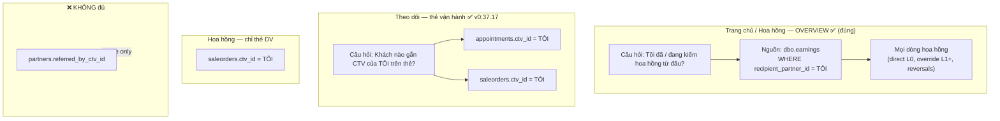
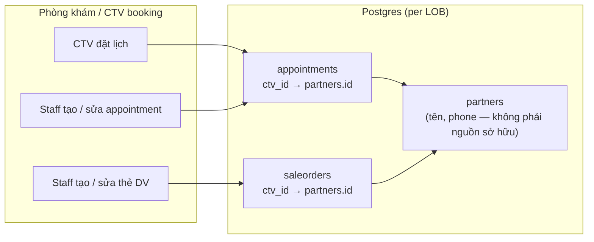
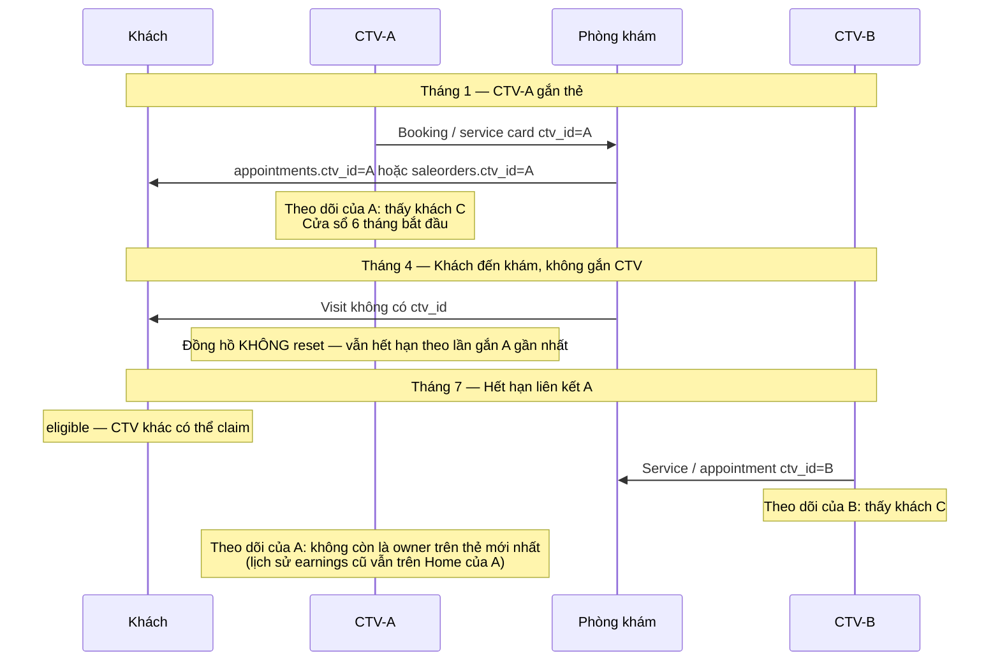
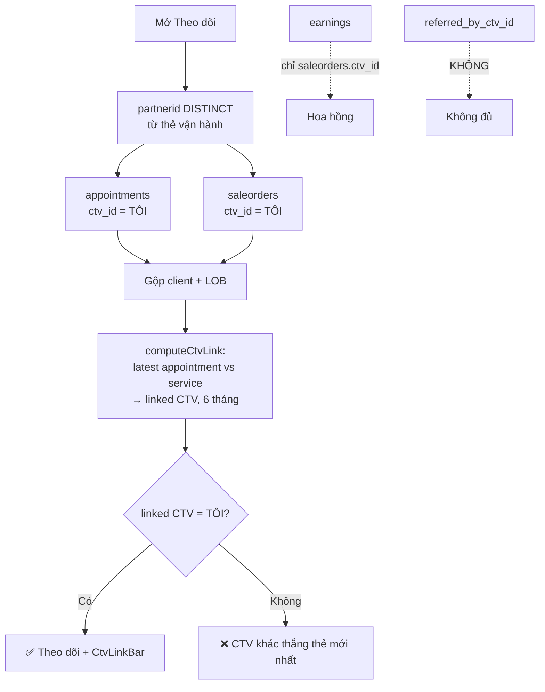
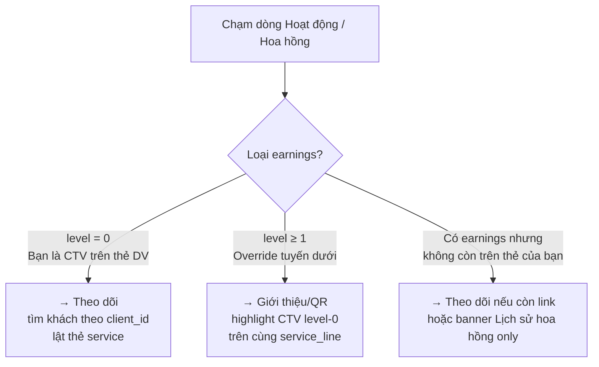

# CTV Portal: Overview vs Theo dõi — Corrected Workflow (2026-06-15)

**Status:** Chart + **implemented in v0.37.15–0.37.16** (`ctvCardTrackingReferrals.js`, `GET /referrals`)  
**Stakeholder correction (2026-06-15):** Split commission vs Theo dõi vs 6-month timer:  
- **Service card** `saleorders.ctv_id` = CTV → **commission** (final truth for earnings) + Theo dõi + resets 6-month window  
- **Appointment card** `appointments.ctv_id` = CTV → **Theo dõi** + resets 6-month window; **no commission**  
- **Customer profile** `partners.referred_by_ctv_id` → bookkeeping only; **no commission, no Theo dõi**

Commission money is a **separate** ledger (`earnings`). Another CTV can reclaim a client after the 6‑month window; that client then appears under **their** Theo dõi, not yours.

**Per LOB:** Dental claim lock and cosmetic claim lock are **independent**. A client locked on dental is still **free** on aesthetic/cosmetic until a card exists there (and vice versa). API returns `lob_links.dental` / `lob_links.cosmetic` separately.

**Viewer isolation:** Each CTV sees **only their own** history for a client — their earnings rows and their operational cards (`appointments.ctv_id` / `saleorders.ctv_id` = viewer). Flip-card service lines come from `earnings WHERE recipient_partner_id = viewer`. Another CTV's appointment/service cards never appear. If the client is no longer on the viewer's cards, Home/Commission tap shows commission-history-only (no fake tracking card).

**Supersedes (for product intent):** the “Nhánh A = referred_by_ctv_id” explanation in agent session 2026-06-14/15.  
**Aligns with:** `docs/business-logic/ctv-referral-commission.md`, `docs/superpowers/specs/2026-06-02-ctv-eligibility-bar-breadcrumb-design.md`, `api/src/services/referralClaim.js` (`computeCtvLink`).

**Archived wrong diagram:** user screenshot saved at  
`docs/live-artifacts/ctv-workflow-archived/2026-06-15-stale-referred-by-diagram.png` (copy of session image #1).

---

## 1. Two tabs, two questions (corrected)



| Tab | Question | Authority data |
|-----|----------|----------------|
| **Trang chủ / Hoa hồng** | Where did I earn? | `earnings` (append-only ledger) |
| **Theo dõi (target)** | Which clients have my CTV on an operational card? | `appointments.ctv_id` ∪ `saleorders.ctv_id` |
| **Commission (earnings)** | When do I get paid? | `saleorders.ctv_id` only |
| **Not for commission / Theo dõi** | — | `partners.referred_by_ctv_id` |

---

## 2. How a customer gets linked to a CTV (card-only)



**Không có** mũi tên “sở hữu” từ `partners.referred_by_ctv_id` trong sơ đồ target.

---

## 3. Six-month claim window (why another CTV can “take” the client later)

Rule from `computeCtvLink` / eligibility spec:



| Thời điểm | CTV-A Theo dõi | CTV-B Theo dõi | CTV-A Home (earnings) |
|-----------|----------------|----------------|------------------------|
| A gắn thẻ | ✅ Khách C | — | ✅ Nếu có commission |
| Hết 6 tháng | ❌ (eligible) | — | ✅ Lịch sử giữ nguyên |
| B gắn thẻ mới | ❌ | ✅ Khách C | ✅ Lịch sử A vẫn có |

---

## 4. Who appears on Theo dõi? (target decision tree)



**Tóm tắt:**

- **Có trên Theo dõi** ⇔ bạn thắng **thẻ appointment hoặc service mới nhất** (`computeCtvLink`, 6 tháng).
- **Appointment có CTV** → Theo dõi ✅, reset 6 tháng ✅, hoa hồng ❌ (chưa có thẻ DV).
- **Có trên Home** ⇔ bạn có **dòng earnings** (kể cả khách đã bị CTV khác reclaim).
- **`ZZ_CTVCHECK_*` trên Home** = có `earnings`, có thể **không** có thẻ `ctv_id` hợp lệ cho bạn → có thể **không** thuộc Theo dõi target (đúng với QA test data).

---

## 5. Tap row on Home → where to go (breadcrumb target)



---

## 6. Current code vs target (gap — fix one at a time)

| Piece | Today (code) | Target (this chart) |
|-------|----------------|---------------------|
| `GET /commission-summary` | `earnings` ✅ | Keep |
| `GET /referrals` (Theo dõi) | ✅ `appointments.ctv_id` ∪ `saleorders.ctv_id` + per-LOB `lob_links` + `computeCtvLink` (v0.37.15–0.37.18) | Keep |
| `referralClaim.getCtvLinkStatus` | ✅ Uses `appointments.ctv_id` + `saleorders.ctv_id` (fallback `referred_by` in code) | Remove fallback for **portal list**; cards only |
| UI copy “khách giới thiệu” | Implies referred_by | “Khách gắn CTV trên thẻ” |

**Fix order (agreed: chart first, then code one step at a time):**

1. ✅ This document + diagrams  
2. ✅ Rewrite `GET /referrals` query to card-based client set (v0.37.15)  
3. ✅ Drop `referred_by_ctv_id` filter from Theo dõi `/referrals`  
4. ✅ Align i18n with card / earnings split  
5. ✅ Service-card-only for commission + L0 attribution (v0.37.16)  
6. ✅ Appointment ctv_id back on Theo dõi + 6-month reset via computeCtvLink (v0.37.17)  
7. ✅ Unit test reclaim scenario (spec §6.7 in `ctvCardTrackingReferrals.test.js`); ⏳ live verify A → expire → B on Theo dõi

---

## 7. ASCII quick reference (mobile-friendly)

```
OVERVIEW (Home/Hoa hồng)          THEO DÕI (target)
─────────────────────────          ─────────────────────────
earnings ← saleorders.ctv_id       appointments.ctv_id = ME
        │                          saleorders.ctv_id = ME
        │                          (Theo dõi + 6mo timer)
        │                                    │
        ▼                                    ▼
"Mọi dòng hoa hồng"                "Khách trên thẻ của tôi"
(past + present)                    (latest card wins, 6mo bar)

        │                                    │
        └──────── same client ───────────────┘
              may differ after reclaim
```

---

## 8. References

- Stale agent diagram (user image #1): `docs/live-artifacts/ctv-workflow-archived/2026-06-15-stale-referred-by-diagram.png`
- Eligibility bar spec: `docs/superpowers/specs/2026-06-02-ctv-eligibility-bar-breadcrumb-design.md`
- Business rules: `docs/business-logic/ctv-referral-commission.md`
- Implementation (Theo dõi, correct since v0.37.15): `api/src/services/ctvCardTrackingReferrals.js` via `api/src/routes/ctv.js` `GET /referrals` (no `referred_by_ctv_id` discovery)
- Staff read APIs (`GET /api/SaleOrders`, `GET /api/Appointments`, cosmetic mirrors) return `ctv_id` from the operational card column (`saleorders.ctv_id` / `appointments.ctv_id`), not inferred from profile `referred_by_ctv_id` alone — align write paths when agent fixes drift