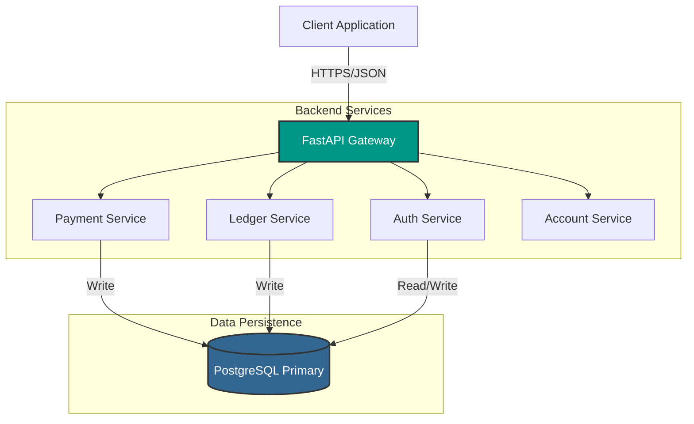
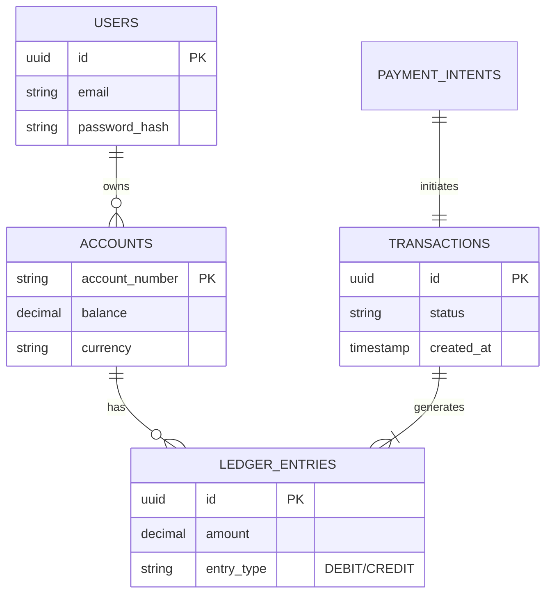

# 💳 Payment Processing Backend (Industry Grade)

> A high-performance, secure payment processing system built with FastAPI, implementing double-entry accounting, JWT authentication, and ACID-compliant financial operations.

[](https://www.python.org/)
[](https://fastapi.tiangolo.com/)
[](https://www.postgresql.org/)
[](LICENSE)
[](https://github.com/psf/black)

---

## 🎯 Overview

This project represents a **production-ready financial backend** designed to handle sensitive payment operations securely. Unlike simple CRUD applications, this system implements core fintech principles such as **Double-Entry Ledger Accounting**, **Idempotency**, and **Race Condition Handling**.

### ✨ Key Features

🔐 **Enterprise-Grade Security**
- JWT-based stateless authentication with refresh token rotation.
- Bcrypt password hashing & salt.
- Role-Based Access Control (RBAC) middleware.

💰 **Robust Financial Engine**
- **Double-Entry Ledger:** Every transaction has a balanced debit and credit entry.
- **Idempotency:** Prevents duplicate processing of the same request.
- **ACID Transactions:** Guarantees data integrity using PostgreSQL transaction blocks.
- **Money Holds:** Pre-authorization logic (Escrow support).

🚀 **High Performance**
- Async I/O with `asyncpg` connection pooling.
- Optimized database indexing for financial queries.
- Pydantic v2 for lightning-fast data validation.

---

## 🏗️ Architecture

The system follows a layered architecture pattern ensuring separation of concerns.



---

## 📂 Project Structure

```bash
payment-backend/
├── app/
│   ├── api/            # Route handlers (v1)
│   ├── core/           # Config, Security, Database setup
│   ├── models/         # SQLAlchemy ORM models
│   ├── schemas/        # Pydantic data schemas
│   ├── services/       # Business logic (Payment, Auth, Ledger)
│   └── utils/          # Helper functions
├── alembic/            # Database migrations
├── tests/              # Pytest suites
├── .env.example        # Environment variables template
├── main.py             # Application entry point
└── requirements.txt    # Dependencies
```

---

## 📊 Database Schema (Simplified)

The core of the system relies on the relationship between Transactions and Ledger Entries.



---

## 🚀 Quick Start

### Prerequisites
- Python 3.9+
- PostgreSQL 14+
- Git

### Installation Steps

1. **Clone the repository**
   ```bash
   git clone https://github.com/Ir-Rafi/Payment-Processing-Backend-Industry-Grade-.git
   cd Payment-Processing-Backend-Industry-Grade-
   ```

2. **Virtual Environment Setup**
   ```bash
   python -m venv venv
   # Windows
   venv\Scripts\activate
   # macOS/Linux
   source venv/bin/activate
   ```

3. **Install Dependencies**
   ```bash
   pip install -r requirements.txt
   ```

4. **Environment Configuration**
   Create a `.env` file based on the example:
   ```bash
   cp .env.example .env
   ```
   *Update `DATABASE_URL` and `JWT_SECRET_KEY` in the `.env` file.*

5. **Database Migration**
   ```bash
   # If using Alembic
   alembic upgrade head
   
   # Or using raw SQL
   psql -U postgres -d fincore_day1 -f schema/init.sql
   ```

6. **Launch Server**
   ```bash
   uvicorn main:app --reload
   ```
   Access the API at: `http://localhost:8000/docs`

---

## 📚 API Overview

Detailed documentation is available via Swagger UI (`/docs`). Here are the primary endpoints:

| Module | Method | Endpoint | Description |
| :--- | :--- | :--- | :--- |
| **Auth** | `POST` | `/auth/register` | Register new user & create wallet |
| **Auth** | `POST` | `/auth/login` | Get Access & Refresh Tokens |
| **Payment** | `POST` | `/payments` | Initiate a payment (Idempotent) |
| **Payment** | `POST` | `/transfer` | P2P Fund Transfer |
| **Refund** | `POST` | `/refunds` | Process full/partial refunds |
| **Account** | `GET` | `/accounts/{id}/balance` | Get real-time balance |
| **Account** | `GET` | `/accounts/history` | Get transaction audit log |

### Example: Create Payment

**Request:**
```json
POST /api/v1/payments
{
  "idempotency_key": "unique-uuid-v4",
  "from_account": "ACC_1001",
  "to_account": "ACC_2002",
  "amount": 50.00,
  "currency": "USD",
  "description": "Service payment"
}
```

**Response:**
```json
{
  "status": "success",
  "transaction_id": "tx_789xyz",
  "new_balance": 950.00,
  "timestamp": "2024-03-15T10:30:00Z"
}
```

---

## 💡 Core Concepts Explained

### Double-Entry Ledger System
Instead of just updating a balance column (e.g., `balance = balance - 50`), this system creates immutable ledger entries for every transaction. This ensures that money is never created or destroyed, only moved.

| Account | Entry Type | Amount |
| :--- | :--- | :--- |
| **Sender (Alice)** | DEBIT | -$50.00 |
| **Receiver (Bob)** | CREDIT | +$50.00 |
| **System Check** | **SUM** | **$0.00** |

### Idempotency
Network failures can cause requests to be retried. We use an `idempotency_key` header/field. If the server receives a key it has already processed, it returns the *stored result* of the original operation without re-processing the payment.

---

## 🤝 Contributing

Contributions are welcome!

1. Fork the Project
2. Create your Feature Branch (`git checkout -b feature/NewFeature`)
3. Commit your Changes (`git commit -m 'Add some NewFeature'`)
4. Push to the Branch (`git push origin feature/NewFeature`)
5. Open a Pull Request

---

## 👨‍💻 Author

**Ir-Rafi**

[](https://github.com/Ir-Rafi)
[](https://linkedin.com)

---

## 📄 License

Distributed under the MIT License. See `LICENSE` for more information.
