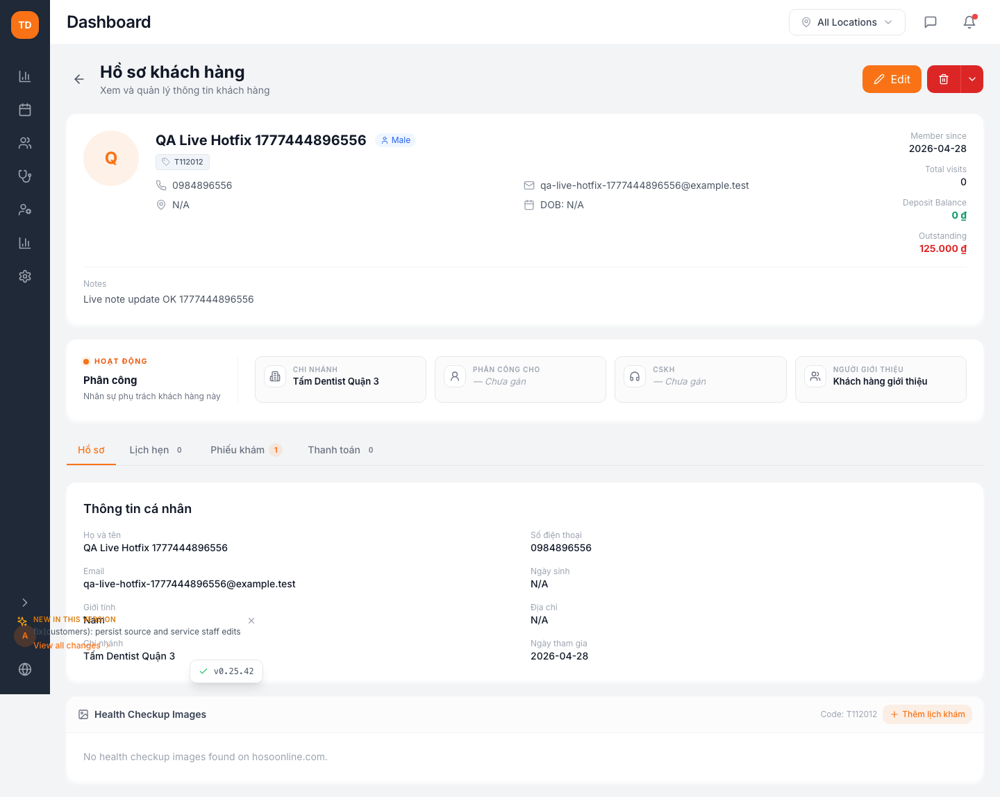
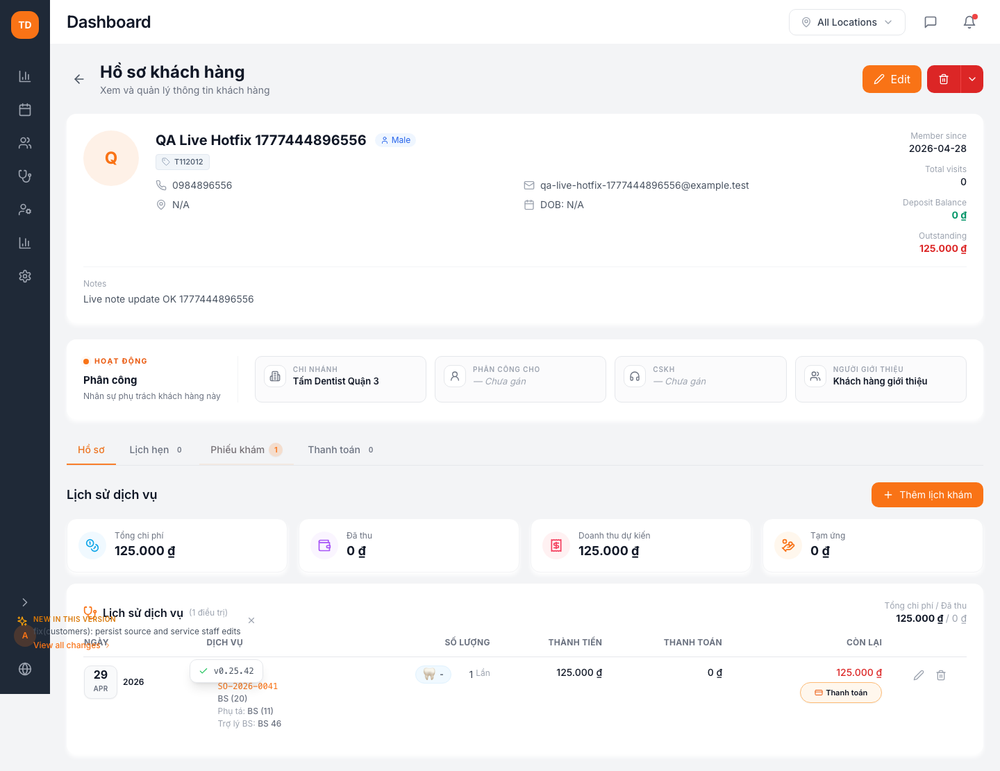
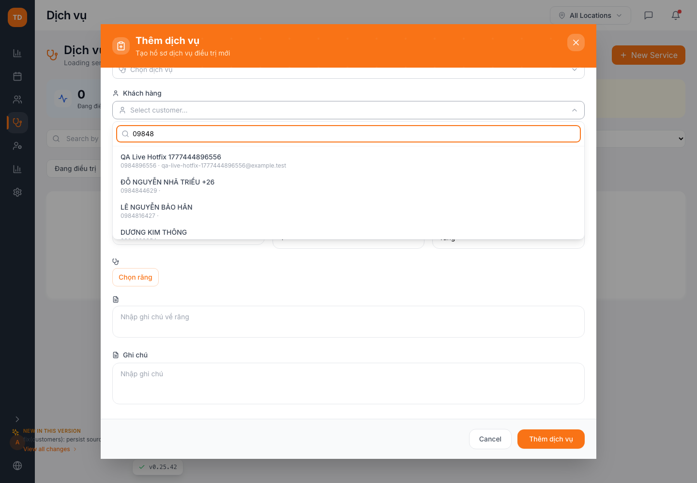
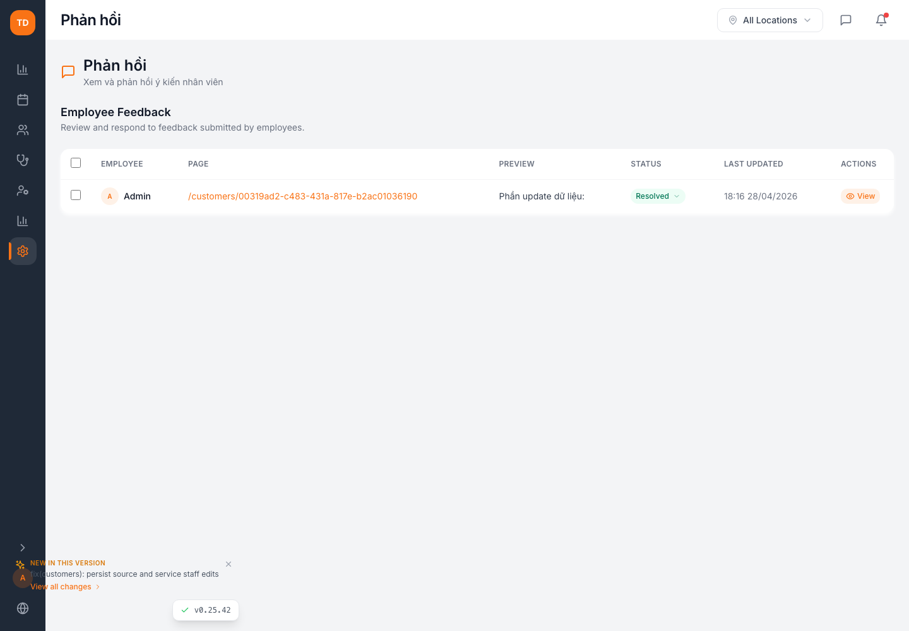

# Live Hotfix Proof Report

Generated: 2026-04-29T07:01:07.579Z
Site: https://nk.2checkin.com
Target customer: QA Live Hotfix 1777444896556 (0984896556)

## Checks

| Status | Check | Evidence |
| --- | --- | --- |
| PASS | API login | Admin login succeeded for read-only verification. |
| PASS | Live deployed version | version.json reports 0.25.42. |
| PASS | Customer note API | note = Live note update OK 1777444896556 |
| PASS | Customer source API | source id/name is present: Khách hàng giới thiệu. |
| PASS | 5-digit phone API search | 09848 returned QA Live Hotfix 1777444896556. |
| PASS | Feedback status API | thread 954d1ca4-4950-4064-873a-b007c3dda7df is resolved. |
| PASS | UI login | Live admin UI loaded nav after login. |
| PASS | Customer profile UI | profile displays name, note, and source. |
| PASS | Customer records UI | records display product and staff fields: ART, BS (20), BS (11), BS 46. |
| PASS | Service create 5-digit search UI | 09848 shows QA Live Hotfix 1777444896556 / 0984896556. |
| PASS | Feedback UI | Feedback page displays resolved status options/rows. API confirmed target thread is resolved. |

## Screenshots

### Customer profile: note + source
QA Live Hotfix 1777444896556 shows note "Live note update OK 1777444896556" and source "Khách hàng giới thiệu".

### Customer records: doctor + assistant + Trợ lý BS
Records tab displays BS (20), BS (11), and BS 46.

### Services: 5-digit customer phone search
Creating a service and searching 09848 returns QA Live Hotfix 1777444896556.

### Feedback: resolved state
Feedback page loaded; API confirms thread 954d1ca4-4950-4064-873a-b007c3dda7df is resolved.

## Browser/API Noise

API failures captured during UI pass: 0
Console errors captured during UI pass: 1
- Error fetching employees: TypeError: Failed to fetch     at an (https://nk.2checkin.com/assets/index-BQJVPVu_.js:76:111215)     at z (https://nk.2checkin.com/assets/useEmployees-Gdx43Tzn.js:1:277)     at https://nk.2checkin.com/assets/useEmployees-Gdx43Tzn.js:8:1374     at https://nk.2checkin.com/as
